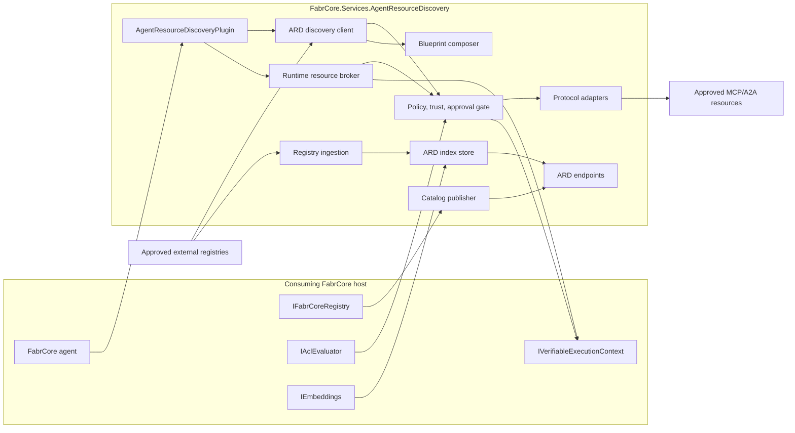
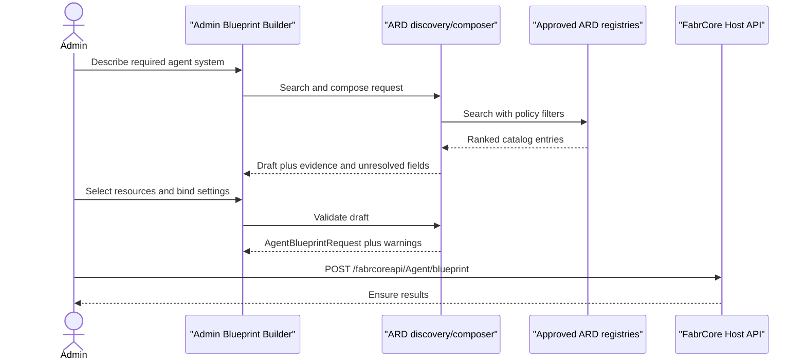

# Agentic Resource Discovery implementation plan

**Target project:** `FabrCore.Services.AgentResourceDiscovery`  
**Document status:** Proposed  
**Date:** July 14, 2026  
**Specification baseline:** ARD v0.9 draft at commit [`afd447d88ed165427687d8af37e8d42398552b56`](https://github.com/ards-project/ard-spec/tree/afd447d88ed165427687d8af37e8d42398552b56)  
**Research input:** [ARD and FabrCore research report](research/ard-fabrcore-fit-research.md)

## 1. Decision summary

Implement Agentic Resource Discovery as one optional class library:

```text
src/FabrCore.Services.AgentResourceDiscovery/
```

The library will reference FabrCore's public contracts but will not require source changes to `FabrCore.Core`, `FabrCore.Sdk`, `FabrCore.Host`, or any other existing FabrCore library. A consuming server opts in from its composition root by registering the service and mapping its endpoints.

The implementation will support three FabrCore roles:

1. **Publisher:** expose explicitly approved FabrCore and deployment resources through an ARD-compatible `ai-catalog.json`.
2. **Client and runtime broker:** search approved ARD registries and safely invoke selected remote resources through stable FabrCore plugin functions.
3. **Registry:** optionally ingest catalogs and expose ARD search, explore, and list endpoints.

The implementation will use the **stable broker pattern** for runtime agents. Agents start with one `AgentResourceDiscovery` plugin and can discover or invoke different resources on later turns without changing their native plugin/tool collection. ARD will not hot-load CLR assemblies or mutate an existing `ChatClientAgent` tool schema.

## 2. Non-negotiable constraints

### 2.1 Repository and dependency boundary

- All ARD production code lives in `FabrCore.Services.AgentResourceDiscovery`.
- Existing FabrCore library source and public interfaces remain unchanged.
- The new project may reference `FabrCore.Core` and `FabrCore.Sdk`.
- The project should avoid a `FabrCore.Host` reference unless a required public contract cannot be reached through Core, SDK, or ASP.NET abstractions.
- HTTP endpoints are mapped by extension methods from the new library; no controllers are added to `FabrCore.Host`.
- The consuming application must call the ARD registration and endpoint-mapping extensions. Those composition-root calls are expected integration work, not changes to FabrCore libraries.
- Adding the new project and its tests to `src/FabrCore.sln` is repository plumbing, not a dependency from existing FabrCore projects.

### 2.2 Runtime boundary

- Discovery is not authorization.
- Relevance is not trust or approval.
- Catalog metadata never contains runtime secrets.
- The service never downloads or loads discovered .NET assemblies at runtime.
- Local FabrCore agents, plugins, and tools must already be deployed and discoverable by FabrCore before they can be referenced by a Blueprint.
- Remote execution is protocol-specific. MCP is implemented first; A2A and other adapters are later additions.
- Each FabrCore agent gets its own ARD plugin instance and resource sessions. MCP clients and other mutable tool instances are never shared between agents.
- Native tools remain fixed when the underlying agent session is created. Dynamic behavior is provided through stable `search`, `inspect`, and `invoke` broker functions.

### 2.3 Compatibility boundary

- Pin implementation and tests to the reviewed ARD commit until ARD publishes a stable release.
- Name the initial profile `FabrCore ARD Experimental Profile 1`.
- Emit canonical `urn:air:` identifiers and `application/mcp-server-card+json` media types.
- Preserve unknown JSON properties when parsing and round-tripping catalog artifacts.
- Keep any legacy aliases at the input compatibility boundary and never emit them as canonical output.
- Report the supported profile in response headers, logs, diagnostics, and package documentation.

## 3. Goals and non-goals

### Goals

- Publish an ARD catalog for explicitly configured, retrievable resources.
- Query one or more operator-approved ARD registries using typed requests and responses.
- Validate ARD manifests, entries, and registry responses against the pinned profile.
- Provide deterministic registry, resource, trust, fetch, and approval policy gates.
- Expose a model-facing FabrCore plugin with a small, stable function surface.
- Broker approved MCP resource calls without rebuilding an active agent session.
- Support admin-facing runtime Blueprint composition from discovered resources.
- Optionally host an enterprise ARD registry with ingestion, hybrid search, facets, pagination, and controlled federation.
- Emit auditable telemetry for discovery, policy decisions, approvals, connections, and invocations.
- Remain disabled and inert unless explicitly registered and enabled by the consuming application.

### Non-goals for the initial implementation

- Replacing `IFabrCoreRegistry` or `GET /fabrcoreapi/Discovery`.
- Replacing FabrCore agent handles, Orleans routing, ACLs, state, or execution evidence.
- Automatically installing NuGet packages or loading untrusted CLR code.
- Advertising a FabrCore endpoint as MCP or A2A unless it implements that protocol.
- Treating ARD search scores as trust, safety, quality, or authorization scores.
- Persisting or continuously reconciling FabrCore Blueprints inside the current Host Blueprint API.
- Automatically reconfiguring existing agents when a Blueprint version changes.
- Enabling unrestricted ARD `auto` federation by default.

## 4. Target architecture



The same package can be used in progressively larger modes:

| Mode | Enabled components | Intended use |
|---|---|---|
| Contracts/client only | Models, validation, typed HTTP client | Application and admin tooling |
| Publisher | Client plus catalog projection and well-known endpoint | Advertise approved resources |
| Agent discovery | Client plus stable FabrCore plugin | Runtime search and recommendations |
| Runtime broker | Agent discovery plus policy, approval, and MCP adapter | Controlled dynamic invocation |
| Registry | Ingestion, index, search/explore/list APIs | Enterprise catalog and federation |

## 5. Project and namespace layout

```text
src/FabrCore.Services.AgentResourceDiscovery/
├── FabrCore.Services.AgentResourceDiscovery.csproj
├── AgentResourceDiscoveryExtensions.cs
├── AgentResourceDiscoveryDefaults.cs
├── AgentResourceDiscoveryMarker.cs
├── Configuration/
│   ├── AgentResourceDiscoveryOptions.cs
│   ├── ArdPublisherOptions.cs
│   ├── ArdClientOptions.cs
│   ├── ArdRegistryOptions.cs
│   ├── ArdSecurityOptions.cs
│   └── Validators/
├── Contracts/
│   ├── ArdCatalog.cs
│   ├── ArdCatalogEntry.cs
│   ├── ArdHostInfo.cs
│   ├── ArdTrustManifest.cs
│   ├── ArdSearchRequest.cs
│   ├── ArdSearchResponse.cs
│   ├── ArdExploreContracts.cs
│   ├── ArdListContracts.cs
│   └── ArdError.cs
├── Compatibility/
│   ├── ArdProfile.cs
│   ├── ArdMediaTypes.cs
│   ├── ArdIdentifier.cs
│   ├── ArdJsonSerializerContext.cs
│   └── ArdSchemaValidator.cs
├── Publishing/
│   ├── IArdCatalogProjection.cs
│   ├── FabrCoreCatalogProjection.cs
│   ├── IArdCatalogSigner.cs
│   ├── ArdCatalogDocumentProvider.cs
│   └── ArdPublishedResourceDescriptor.cs
├── Client/
│   ├── IArdDiscoveryClient.cs
│   ├── ArdDiscoveryClient.cs
│   ├── IArdRegistryResolver.cs
│   ├── ArdRegistryResolver.cs
│   └── ArdResponseCache.cs
├── Security/
│   ├── IArdRegistryPolicy.cs
│   ├── IArdResourcePolicy.cs
│   ├── IArdTrustVerifier.cs
│   ├── IArdFetchPolicy.cs
│   ├── IArdApprovalService.cs
│   ├── IArdSafeFetcher.cs
│   ├── ArdPolicyDecision.cs
│   └── ArdActions.cs
├── Runtime/
│   ├── AgentResourceDiscoveryPlugin.cs
│   ├── IArdResourceBroker.cs
│   ├── ArdResourceBroker.cs
│   ├── IArdResourceAdapter.cs
│   ├── ArdResourceAdapterRegistry.cs
│   ├── ArdResourceSessionManager.cs
│   └── Mcp/
│       ├── ArdMcpServerCard.cs
│       ├── ArdMcpResourceAdapter.cs
│       ├── IArdMcpClientFactory.cs
│       └── ArdMcpClientSession.cs
├── Blueprints/
│   ├── IArdBlueprintComposer.cs
│   ├── ArdBlueprintComposer.cs
│   ├── ArdBlueprintDraft.cs
│   ├── ArdBlueprintValidationResult.cs
│   └── ArdAgentConfigurationMapper.cs
├── Registry/
│   ├── IArdCatalogSource.cs
│   ├── ArdCatalogIngestionService.cs
│   ├── IArdIndexStore.cs
│   ├── ArdIndexedEntry.cs
│   ├── ArdSearchService.cs
│   ├── ArdExploreService.cs
│   ├── ArdFederationService.cs
│   └── Storage/
├── Endpoints/
│   ├── ArdEndpointRouteBuilderExtensions.cs
│   ├── ArdPublisherEndpoints.cs
│   ├── ArdRegistryEndpoints.cs
│   └── ArdBlueprintEndpoints.cs
├── Diagnostics/
│   ├── ArdActivitySource.cs
│   ├── ArdMetrics.cs
│   └── ArdHealthCheck.cs
├── Schemas/
│   ├── ai-catalog.schema.json
│   └── ard.openapi.yaml
└── README.md
```

Test code should live in a sibling `FabrCore.Services.AgentResourceDiscovery.Tests` project. It may reference the new library and public FabrCore test utilities but must not require test-only changes to existing libraries.

## 6. Project dependencies

The production project should use this dependency budget:

```xml
<Project Sdk="Microsoft.NET.Sdk">
  <PropertyGroup>
    <TargetFramework>net10.0</TargetFramework>
    <ImplicitUsings>enable</ImplicitUsings>
    <Nullable>enable</Nullable>
  </PropertyGroup>

  <ItemGroup>
    <FrameworkReference Include="Microsoft.AspNetCore.App" />
  </ItemGroup>

  <ItemGroup>
    <ProjectReference Include="..\FabrCore.Core\FabrCore.Core.csproj" />
    <ProjectReference Include="..\FabrCore.Sdk\FabrCore.Sdk.csproj" />
  </ItemGroup>
</Project>
```

Additional direct package references should be added only when implementation begins:

- a JSON Schema Draft 2020-12 validator, pinned and license-reviewed;
- `ModelContextProtocol`, pinned to the same compatible version used by `FabrCore.Sdk`, for the independent broker client;
- OpenTelemetry abstractions only if they are not adequately available through current references;
- a production index provider package only when its adapter is implemented.

Do not depend on transitive MCP types accidentally. The ARD project should explicitly own and test the MCP SDK version it compiles against.

## 7. Public integration surface

### 7.1 Registration

Follow the existing optional service add-on pattern:

```csharp
builder.AddFabrCoreServer();

builder.AddAgentResourceDiscovery(options =>
{
    options.Enabled = true;
    options.Profile = ArdProfiles.Experimental1;

    options.Client.Registries.Add(new ArdRegistryRegistration
    {
        Name = "enterprise",
        BaseUrl = new Uri("https://registry.example.com/api/v1/"),
        AllowedFederation = ArdFederationMode.Referrals
    });

    options.Publisher.Enabled = true;
    options.Publisher.Domain = "agents.example.com";
});

var app = builder.Build();
app.UseFabrCoreServer();
app.UseAgentResourceDiscovery();
app.Run();
```

Proposed extension methods:

```csharp
public static IHostApplicationBuilder AddAgentResourceDiscovery(
    this IHostApplicationBuilder builder,
    Action<AgentResourceDiscoveryOptions>? configure = null);

public static WebApplication UseAgentResourceDiscovery(
    this WebApplication app);
```

`AddAgentResourceDiscovery` must load the add-on assembly before `IFabrCoreRegistry` performs its lazy plugin scan. The registration method should be called after `AddFabrCoreServer` and before the application is built. The plugin alias is then available for agent configurations:

```csharp
Plugins = ["AgentResourceDiscovery"];
```

### 7.2 Service contracts

The first stable public contracts should be:

```csharp
public interface IArdDiscoveryClient
{
    Task<ArdSearchResponse> SearchAsync(
        ArdSearchRequest request,
        ArdRequestContext context,
        CancellationToken cancellationToken = default);

    Task<ArdExploreResponse> ExploreAsync(
        ArdExploreRequest request,
        ArdRequestContext context,
        CancellationToken cancellationToken = default);

    Task<ArdListResponse> ListAsync(
        ArdListRequest request,
        ArdRequestContext context,
        CancellationToken cancellationToken = default);

    Task<ArdResolvedResource> InspectAsync(
        string identifier,
        ArdRequestContext context,
        CancellationToken cancellationToken = default);
}

public interface IArdResourceBroker
{
    Task<ArdInvocationResult> InvokeAsync(
        ArdInvocationRequest request,
        ArdRequestContext context,
        CancellationToken cancellationToken = default);
}

public interface IArdBlueprintComposer
{
    Task<ArdBlueprintDraft> ComposeAsync(
        ArdBlueprintCompositionRequest request,
        ArdRequestContext context,
        CancellationToken cancellationToken = default);

    Task<ArdBlueprintValidationResult> ValidateAsync(
        ArdBlueprintDraft draft,
        ArdRequestContext context,
        CancellationToken cancellationToken = default);
}
```

`ArdRequestContext` must carry the principal, optional full agent handle, tenant/policy partition, correlation/trace identifiers, and whether the request is interactive or autonomous. Policy decisions must not infer identity from model-supplied arguments.

## 8. ARD contracts and validation

### 8.1 Contract rules

- A catalog has `specVersion`, optional host information, and entries.
- Every entry requires `identifier`, `displayName`, `type`, and exactly one of `url` or `data`.
- Identifiers are parsed into a value type that enforces the pinned `urn:air:<domain>:<segments...>:<name>` profile.
- Media types are parsed and normalized without discarding their original value.
- Unknown extension fields are preserved with `JsonExtensionData`.
- `updatedAt` is handled as an offset-aware timestamp.
- Search score is stored separately from trust, policy, health, cost, and observed-quality data.
- Empty result collections remain operationally valid even where the current CDDL and JSON Schema disagree.
- Search page size is limited to 100 for the pinned profile.

### 8.2 Validation levels

Implement three explicit validation levels:

1. **Syntax:** valid JSON, size/depth limits, expected root shape.
2. **Profile:** JSON Schema plus pinned semantic rules such as value-or-reference exclusivity, canonical URNs, and page limits.
3. **Policy:** registry, publisher, media type, protocol, trust, tenant, and invocation decisions.

Validation errors must include a stable code, JSON path, human-readable message, and severity. Never return raw downstream HTML or unbounded response content as an error.

### 8.3 Embedded specification assets

Embed the pinned JSON Schema and OpenAPI documents in the assembly. Record their upstream commit and SHA-256 digest in `ArdProfile`. CI must fail if a developer changes an embedded schema without updating the profile metadata and golden tests.

## 9. Publisher implementation

### 9.1 Publication policy

Publication is explicit. Do not automatically expose all entries returned by `IFabrCoreRegistry`.

`ArdPublisherOptions` should accept resource descriptors keyed by a stable local key:

```csharp
options.Publisher.Resources.Add(new ArdPublishedResourceDescriptor
{
    LocalKind = ArdLocalResourceKind.Agent,
    LocalAlias = "research-agent",
    Identifier = "urn:air:agents.example.com:fabrcore:agent:research-agent",
    DisplayName = "Research Agent",
    MediaType = "application/a2a-agent-card+json",
    CardUrl = new Uri("https://agents.example.com/cards/research-agent.json"),
    RepresentativeQueries =
    [
        "research a technical standard",
        "compare implementation approaches"
    ]
});
```

The projector validates that:

- the local alias exists and has no unresolved collision;
- the entry was not hidden by FabrCore;
- the descriptor has a real card URL or inline artifact;
- the claimed media type matches the available invocation protocol;
- identifiers use the configured publisher domain;
- public catalogs do not contain private ACL, tenant, endpoint-secret, or environment data.

### 9.2 Endpoint behavior

Map the publisher document at:

```text
GET /.well-known/ai-catalog.json
```

Requirements:

- deterministic JSON serialization and ordering;
- `application/json` response type;
- ETag computed from canonical content;
- configurable cache headers;
- conditional `If-None-Match` handling;
- last-known-good behavior if regeneration fails after startup;
- startup failure when enabled publication has no valid resources, unless explicitly configured to serve an empty catalog;
- optional signing through `IArdCatalogSigner`;
- no authentication by default for a public well-known catalog, with an explicit private-catalog mode for internal deployments.

## 10. Discovery client

### 10.1 Registry selection

- Query only named registries configured by the operator.
- Default federation to `none` or `referrals`.
- Require explicit configuration for `auto`.
- Resolve referrals through the same registry policy and safe-fetch path as root registries.
- Enforce maximum referral depth, total registries, total results, and loop detection.
- Retain each result's source registry and normalization history.

### 10.2 Caching

Cache keys must include:

- registry identity and base URL;
- normalized query text and filters;
- federation mode;
- page size/token;
- tenant/policy partition;
- authorization-sensitive registry identity;
- profile version.

Support ETag/TTL invalidation and bounded cache size. Never share a cached private result across policy or tenant partitions.

### 10.3 Result handling

- Validate every response before returning it to callers.
- Preserve the registry-provided score as relevance only.
- Apply policy filtering before showing results to a model or admin.
- Bound and delimit untrusted descriptions before adding them to model context.
- Return concise summaries by default; fetch full cards only through `InspectAsync`.

## 11. Security, trust, and approval

### 11.1 ACL actions

Define add-on-owned actions without changing FabrCore permission constants:

```csharp
public static class ArdActions
{
    public static readonly AclAction Search = new("ard", "search");
    public static readonly AclAction Inspect = new("ard", "inspect");
    public static readonly AclAction ComposeBlueprint = new("ard", "compose-blueprint");
    public static readonly AclAction Invoke = new("ard", "invoke");
    public static readonly AclAction Admin = new("ard", "admin");
}
```

Evaluate these through the existing public `IAclEvaluator`. The add-on should provide convenience extension methods and documented grant names while keeping action ownership inside the new assembly.

### 11.2 Safe fetching and SSRF protection

All catalog, card, referral, and attestation retrieval must use `IArdSafeFetcher`.

The fetcher must:

- allow HTTPS by default and reject user-info URLs;
- resolve and validate every destination address;
- reject loopback, link-local, multicast, unspecified, and disallowed private ranges;
- pin the validated address for the connection or otherwise prevent DNS rebinding;
- disable automatic redirects and revalidate every redirect target;
- restrict ports, methods, content types, response sizes, decompressed sizes, JSON depth, and timeouts;
- cap redirects and total fetch work;
- avoid forwarding credentials across origins;
- redact query strings, headers, and bodies from logs;
- support explicit operator allowlists for legitimate internal registries.

### 11.3 Trust verification

`IArdTrustVerifier` returns structured evidence and a decision; it does not return a Boolean alone. The result should distinguish:

- identifier/domain binding;
- publisher identity resolution;
- signature verification;
- provenance checks;
- attestation presence and verification;
- freshness/version policy;
- unsupported or unverifiable claims.

The initial implementation may ship a conservative verifier that supports configured HTTPS publishers and reports DID/SPIFFE/JWS claims as unsupported until dedicated verifiers are implemented. Unsupported claims must never be silently treated as verified.

### 11.4 Approval

`IArdApprovalService` is called after policy/trust checks and before the first connection or invocation. Default implementations:

- `DenyArdApprovalService` for autonomous production use;
- `ConfiguredArdApprovalService` for preapproved resource identifiers/digests;
- an interface for an admin or user workflow supplied by the consuming application.

Approval records must bind the principal, resource identifier, immutable entry/card digest, allowed operations, expiry, and policy version.

## 12. Stable agent plugin and runtime broker

### 12.1 Plugin surface

Implement one stateful plugin:

```csharp
[PluginAlias("AgentResourceDiscovery")]
public sealed class AgentResourceDiscoveryPlugin : IFabrCorePlugin, IAsyncDisposable
```

Expose a deliberately small tool surface:

```text
search_resources(intent, media_types?, capabilities?, page_size?)
inspect_resource(identifier)
invoke_resource(identifier, operation, arguments_json)
```

Do not expose raw registry URLs, headers, credentials, federation topology, or arbitrary fetch functions to the model.

### 12.2 Lifecycle

- `InitializeAsync` captures the agent configuration and resolves services from the supplied service provider.
- The plugin derives its security context from the FabrCore agent host/configuration, not from model parameters.
- Search and inspect are stateless apart from bounded caches.
- The plugin owns an `ArdResourceSessionManager` for connections created for that agent.
- `IAsyncDisposable.DisposeAsync` closes all resource sessions.
- Connection caches are keyed by resource identifier, card digest, principal/policy partition, and credential binding.
- Revocation, expiry, card version change, policy change, or failed health checks evict the session.

### 12.3 Broker behavior

For every invocation:

1. Resolve the identifier from a validated search/inspect record, not model-provided endpoint data.
2. Revalidate freshness and immutable digests.
3. Evaluate ACL, registry policy, resource policy, and trust.
4. Obtain or verify approval.
5. Select the adapter by canonical media type.
6. Resolve credentials from a host-supplied credential resolver.
7. Connect or reuse the per-agent session.
8. Validate the requested operation and arguments against the adapter's current schema.
9. Invoke with cancellation, timeout, output-size limits, and audit correlation.
10. Return a bounded structured result and record evidence.

The broker does not add discovered operations to the active model's native tool list. The model continues to call `invoke_resource`, which routes dynamically behind the stable function.

## 13. MCP resource adapter

The first runtime adapter targets:

```text
application/mcp-server-card+json
```

Responsibilities:

- fetch and validate the MCP server card through `IArdSafeFetcher`;
- distinguish the card URL from the live MCP transport endpoint;
- support streamable HTTP first;
- keep stdio disabled for remote discovery by default;
- allow stdio only for explicitly configured local resources with fixed executables and arguments;
- resolve secret references through `IArdCredentialResolver` supplied by the host;
- enumerate current MCP tools and validate requested operation names;
- react to tool-list changes within the broker session without exposing an unsafe native-tool mutation path;
- enforce per-call timeout, payload, concurrency, and cancellation limits;
- dispose the MCP session when the owning plugin is disposed.

The adapter must use its own MCP client factory. It must not depend on protected `FabrCoreAgentProxy.ConnectMcpServerAsync`, and it must not require a change to expose that method publicly.

## 14. Runtime Blueprint Builder support

ARD supplies discovery data for Blueprint construction; it does not replace FabrCore's Blueprint contract or lifecycle.

### 14.1 Composition flow



### 14.2 Composer responsibilities

`IArdBlueprintComposer` should:

- discover candidate local FabrCore aliases and remote resources;
- require local agent/plugin/tool aliases to exist in `IFabrCoreRegistry`;
- map approved MCP cards into proposed `McpServerConfig` values without embedding secrets;
- emit secret-binding placeholders for the admin application;
- produce the existing SDK `AgentBlueprintRequest`/`AgentConfiguration` shape;
- validate handles, aliases, models, plugin/tool availability, resource policy, and duplicate assignments;
- attach provenance outside `AgentConfiguration`, including ARD identifier, source, version, entry/card digest, trust result, and approval state;
- distinguish blocking errors, admin decisions, and informational recommendations;
- never submit the Blueprint unless the caller explicitly invokes the existing FabrCore Host API client.

### 14.3 Current FabrCore Blueprint semantics

The builder UI and documentation must state that the existing endpoint:

- is caller-driven and idempotently ensures agents for one principal;
- does not persist Blueprint templates, names, or versions;
- does not continuously reconcile desired state;
- does not remove agents omitted from a later Blueprint;
- ignores `ForceReconfigure = true`;
- does not intentionally change already configured agents.

Draft persistence, Blueprint version history, approval workflows, diffs, and upgrade/rollback plans belong to the admin application or an add-on-owned store. Intentional agent upgrades continue to use existing FabrCore create/reconfigure APIs.

### 14.4 Cataloging Blueprints

A later profile may catalog reusable Blueprint documents using a vendor media type such as:

```text
application/vnd.fabrcore.agent-blueprint+json
```

This is an ARD extension artifact. Its schema, versioning rules, and installation semantics are owned by the new service and must not be presented as part of the ARD core specification.

## 15. Optional ARD registry

### 15.1 Ingestion

`ArdCatalogIngestionService` should:

- crawl configured catalog URLs through the safe fetcher;
- support ETag and Last-Modified conditional requests;
- apply refresh TTL, jitter, exponential backoff, and circuit breaking;
- validate and normalize every document before indexing;
- retain raw document digest, normalized entry, source, fetch time, profile, and validation results;
- detect updates, removals, and tombstones;
- quarantine invalid or policy-rejected sources without deleting the last-known-good index immediately;
- never follow nested catalogs or referrals outside configured limits and policies.

### 15.2 Index abstraction

Define `IArdIndexStore` around ARD query requirements rather than a generic key/value store:

```csharp
public interface IArdIndexStore
{
    Task UpsertAsync(IReadOnlyList<ArdIndexedEntry> entries, CancellationToken cancellationToken);
    Task TombstoneSourceAsync(string sourceId, DateTimeOffset observedAt, CancellationToken cancellationToken);
    Task<ArdSearchResponse> SearchAsync(ArdSearchPlan plan, CancellationToken cancellationToken);
    Task<ArdExploreResponse> ExploreAsync(ArdExplorePlan plan, CancellationToken cancellationToken);
    Task<ArdListResponse> ListAsync(ArdListPlan plan, CancellationToken cancellationToken);
}
```

The index must support:

- tenant/policy partitions;
- exact structured filters and nested trust fields;
- vector similarity over descriptions, capabilities, tags, and representative queries;
- lexical retrieval;
- hybrid ranking such as reciprocal-rank fusion;
- facets and counts;
- deterministic pagination;
- source provenance and tombstones.

Use `IEmbeddings` when an embeddings model is configured. Provide lexical-only behavior when it is unavailable. The production index should be a dedicated store; do not place the full searchable corpus in Orleans grain state.

### 15.3 Registry endpoints

Map an operator-configurable base path, defaulting to:

```text
POST /ard/v1/search
POST /ard/v1/explore
GET  /ard/v1/agents
```

Requirements:

- `/search` is required when registry mode is enabled;
- `/explore` and `/agents` are feature flags until implemented;
- filters are allowlisted against store capabilities;
- pagination tokens are opaque, signed, profile-bound, query-bound, and expiring;
- policy filtering occurs before results are returned;
- `auto` federation is disabled by default;
- referral queries enforce hop and loop limits;
- the registry advertises itself through an optional `application/ai-registry+json` catalog entry.

## 16. Observability and evidence

Create an activity source and meter scoped to the package:

```text
FabrCore.Services.AgentResourceDiscovery
```

Minimum activities:

- `ard.search`
- `ard.explore`
- `ard.inspect`
- `ard.fetch`
- `ard.policy.evaluate`
- `ard.trust.verify`
- `ard.approval`
- `ard.connect`
- `ard.invoke`
- `ard.catalog.publish`
- `ard.catalog.ingest`
- `ard.blueprint.compose`
- `ard.blueprint.validate`

Minimum metrics:

- search count, latency, errors, cache hits, and result count;
- fetch rejections by policy reason;
- validation failures by stable code;
- trust outcomes and approval outcomes;
- active broker sessions and session evictions;
- invocation count, latency, timeout, and downstream failure;
- ingestion freshness, source failures, indexed entries, and tombstones;
- Blueprint candidates, validation failures, and unresolved bindings.

Telemetry must include hashed or stable internal identifiers where useful, but never prompt text, credentials, raw headers, tool arguments, catalog query strings, or unbounded downstream responses by default.

Use `IVerifiableExecutionContext` when available to record policy-sensitive selections and external invocations. Evidence recording remains fail-open only where consistent with current FabrCore behavior; the resource policy may require successful evidence recording for high-risk operations.

## 17. Configuration model

Suggested configuration shape:

```json
{
  "AgentResourceDiscovery": {
    "Enabled": true,
    "Profile": "experimental-1",
    "Publisher": {
      "Enabled": true,
      "Domain": "agents.example.com",
      "CatalogPath": "/.well-known/ai-catalog.json",
      "Public": true
    },
    "Client": {
      "DefaultRegistry": "enterprise",
      "DefaultFederation": "referrals",
      "Registries": [
        {
          "Name": "enterprise",
          "BaseUrl": "https://registry.example.com/api/v1/"
        }
      ]
    },
    "Runtime": {
      "Enabled": false,
      "AllowedMediaTypes": [
        "application/mcp-server-card+json"
      ],
      "AllowRemoteHttpMcp": true,
      "AllowDiscoveredStdio": false
    },
    "Registry": {
      "Enabled": false,
      "BasePath": "/ard/v1",
      "EnableExplore": false,
      "EnableList": false,
      "EnableAutoFederation": false
    },
    "Security": {
      "RequireApprovalForFirstInvocation": true,
      "AllowedSchemes": ["https"],
      "MaxRedirects": 3,
      "MaxResponseBytes": 1048576,
      "FetchTimeoutSeconds": 10
    }
  }
}
```

Options must be validated during startup when the corresponding feature is enabled. Disabled features must not require irrelevant configuration or start background services.

## 18. Phased implementation

### Phase 0 — Project scaffold and compatibility profile

Deliverables:

- create the class library and test project;
- add the project to the solution;
- establish namespaces, extension methods, options, feature flags, and marker service;
- embed the pinned schemas and profile metadata;
- add System.Text.Json source generation;
- add golden ARD fixtures and profile diagnostics;
- document package installation and the no-core-change boundary.

Tests:

- disabled registration is inert;
- registration/mapping order errors are clear;
- embedded schema hashes match profile metadata;
- options validation is feature-specific.

Exit condition: the package registers and maps no active endpoints unless enabled, builds independently, and introduces no project reference from an existing FabrCore library.

### Phase 1 — Contracts, validation, and safe HTTP foundation

Deliverables:

- implement typed catalog and API contracts;
- implement canonical URN/media-type parsing;
- implement strict schema and semantic validation;
- preserve unknown fields during round trips;
- implement named registry configuration and typed HTTP client;
- implement the safe fetcher and default-deny fetch policy;
- implement bounded, partition-aware response caching.

Tests:

- official valid/invalid fixtures;
- value-or-reference exclusivity;
- unknown-field round trips;
- empty search results;
- page-size limits;
- malformed pagination and errors;
- SSRF, redirect, DNS rebinding, decompression, timeout, and payload-limit cases.

Exit condition: the service can safely parse, validate, fetch, and round-trip pinned ARD artifacts without invoking a resource.

### Phase 2 — Publisher and read-only discovery

Deliverables:

- implement explicit publication descriptors and `IFabrCoreRegistry` projection;
- serve the well-known catalog with ETag and cache behavior;
- implement `SearchAsync`, `ExploreAsync`, `ListAsync`, and `InspectAsync`;
- implement registry/resource policies and ACL checks;
- implement the plugin's read-only `search_resources` and `inspect_resource` methods;
- add audit activities, metrics, and health diagnostics;
- run official ARD manifest and registry probes where applicable.

Tests:

- hidden/internal resources never publish;
- collision and missing-alias failures;
- deterministic catalog output and ETag handling;
- registry allowlist and federation defaults;
- policy partition cache isolation;
- malicious descriptions remain bounded data;
- plugin instances are per-agent and independently disposable.

Exit condition: external clients can crawl an approved FabrCore catalog, and a FabrCore agent can discover and explain approved resources but cannot connect or invoke them.

### Phase 3 — Runtime Blueprint composition

Deliverables:

- implement `IArdBlueprintComposer` and validation services;
- map local FabrCore aliases and discovered MCP cards into Blueprint drafts;
- emit SDK `AgentBlueprintRequest` objects and separate provenance records;
- expose optional admin-only compose/validate endpoints;
- support Blueprint discovery through `application/vnd.fabrcore.agent-blueprint+json` only behind an experimental flag;
- document ensure-only and reconfiguration semantics.

Tests:

- missing local aliases/plugins/tools;
- cross-principal handles;
- duplicate handles and conflicting resource assignments;
- secret placeholders never appear as values;
- output round-trips through the existing SDK Blueprint DTO;
- composer never submits or reconfigures without an explicit caller action.

Exit condition: an admin application can search ARD, produce a validated FabrCore Blueprint draft, review provenance and unresolved bindings, and explicitly submit it through the existing Host API.

### Phase 4 — Controlled MCP runtime broker

Deliverables:

- implement structured trust results and approval contracts;
- implement the add-on-owned credential resolver abstraction;
- implement the MCP server-card adapter and streamable HTTP client;
- implement per-agent session ownership, reuse, revocation, and disposal;
- add `invoke_resource` to the stable plugin;
- record selection, approval, connection, and call evidence;
- add kill switches by registry, publisher, resource, tenant, and globally.

Tests:

- first-use approval and digest binding;
- operation/schema validation;
- credential isolation and log redaction;
- timeout, cancellation, reconnect, tool-list change, revocation, and cleanup;
- one agent cannot reuse another agent's resource session;
- no native agent tool list mutation;
- discovered stdio remains denied by default.

Exit condition: a policy-compliant, explicitly approved MCP resource can be discovered on a later conversation turn and invoked through the broker without rebuilding the FabrCore agent session.

### Phase 5 — Enterprise ARD registry

Deliverables:

- implement source configuration and ingestion scheduling;
- implement a production `IArdIndexStore` adapter;
- add lexical, vector, hybrid ranking, filters, facets, and pagination;
- implement search, explore, and list endpoints;
- implement referrals and optional controlled auto federation;
- add source provenance, last-known-good behavior, quarantine, and tombstones;
- add load, isolation, relevance, and operational dashboards.

Tests:

- ingestion refresh, ETag, failures, updates, deletions, and tombstones;
- structured filter semantics and facet correctness;
- deterministic pagination and signed token tamper rejection;
- referral loops and federation limits;
- tenant isolation in records, embeddings, caches, and responses;
- official conformance plus FabrCore semantic/security/load suites.

Exit condition: other ARD clients can query a governed, tenant-safe FabrCore ARD registry with measured relevance, latency, freshness, and conformance.

### Phase 6 — Protocol and trust expansion

Potential deliverables:

- A2A card and invocation adapter;
- DID, SPIFFE, and detached JWS verifiers;
- signed catalog publication;
- richer attestation policy;
- health, cost, and observed-quality signals kept separate from relevance;
- additional registered media-type adapters;
- a separately governed signed package workflow for local plugins, only if required.

Exit condition: each added protocol or trust mechanism has an isolated adapter, conformance fixtures, security review, and explicit operator policy.

## 19. Testing strategy

### Unit tests

- contract serialization and source-generated JSON contexts;
- identifier/media-type parsing;
- semantic validation and stable error codes;
- policy and trust decision composition;
- cache key partitioning;
- Blueprint mapping and validation;
- pagination token signing and parsing;
- ranking and filter plan construction.

### Component tests

- HTTP client against mock registries;
- publisher endpoint and conditional requests;
- safe fetcher against controlled DNS/IP/redirect scenarios;
- plugin lifecycle with independent agent configurations;
- MCP adapter against a deterministic test server;
- ingestion against changing source manifests;
- index provider filter, vector, facet, and pagination behavior.

### Integration tests

- sample FabrCore host with only the new add-on registered;
- agent configured with `Plugins = ["AgentResourceDiscovery"]`;
- discovery after several prior conversation turns;
- admin Blueprint composition and explicit submission through `IFabrCoreHostApiClient`;
- restart, deactivation, cancellation, and resource-session cleanup;
- verifiable-execution records when the context is available;
- ACL enforce, audit-only, and disabled modes.

### Conformance and interoperability

- run the pinned official ARD conformance tool with strict JSON Schema support and UTF-8 output;
- supplement it with semantic tests the official probe does not cover;
- test against at least two independent ARD registry implementations before claiming interoperability;
- publish the exact supported profile and known deviations.

### Security tests

- SSRF and DNS rebinding;
- redirect and credential-forwarding attacks;
- oversized/compressed payloads and JSON bombs;
- malicious catalog descriptions and tool schemas;
- forged URN/domain/trust claims;
- stale approvals and digest substitution;
- cross-tenant cache/index/session leakage;
- federation loops and query exfiltration;
- credential and sensitive-data log scanning.

## 20. Definition of done

The initial production-capable release is complete when Phases 0–4 satisfy all of the following:

- no existing FabrCore library source was modified to support ARD;
- the new package can be enabled or disabled entirely from the consuming application's composition root;
- the pinned profile, schemas, compatibility behavior, and deviations are documented;
- the publisher serves only explicitly approved and genuinely retrievable artifacts;
- read-only search works against configured registries with bounded federation;
- ACL, registry policy, resource policy, trust, approval, and safe-fetch gates are deterministic and outside model control;
- the stable plugin can discover and invoke an approved MCP resource after any number of prior turns;
- MCP sessions are isolated per agent and disposed correctly;
- no discovered CLR assembly is loaded;
- Blueprint drafts use existing SDK contracts and are never automatically submitted or reconciled;
- secrets are referenced and resolved at connection time, never stored in catalogs, Blueprints, telemetry, or model-visible results;
- official conformance, contract, integration, security, and lifecycle tests pass;
- rollback and global/resource-specific kill switches are documented and tested.

Phase 5 registry hosting is a separate production milestone and is not required to ship the publisher/client/broker package.

## 21. Suggested implementation sequence

Use small, independently reviewable changes:

1. Scaffold project, tests, options, extensions, and profile assets.
2. Add contracts, JSON contexts, validation, and fixtures.
3. Add safe fetcher, typed client, policies, and cache.
4. Add explicit catalog publisher and well-known endpoint.
5. Add read-only FabrCore plugin methods.
6. Add Blueprint composer and admin validation surface.
7. Add trust/approval/credential contracts.
8. Add MCP adapter and per-agent broker lifecycle.
9. Add evidence, telemetry, health, and kill switches.
10. Harden with conformance, interoperability, security, and load tests.
11. Implement registry ingestion/index/API as a separate milestone.
12. Add other protocols and trust mechanisms one adapter at a time.

Every change should preserve the central boundary: **FabrCore remains the durable execution and governance platform; `FabrCore.Services.AgentResourceDiscovery` is its optional discovery, publication, composition, and runtime brokering plane.**
