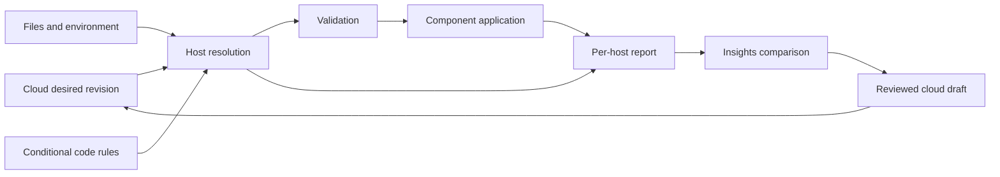

# Cloud configuration, code overrides, and reported state

Status: design implemented locally across FabrCore, Insights, and Impact; deployment is separate. See [implementation and usage](cloud-configuration-reconciliation.md) for delivered behavior and limits. The investigation below describes the pre-change behavior and the broader design, including future work.
Date: 2026-09-13.

## Recommendation

Make configuration bidirectional through separate desired and reported records. Cloud Server publishes intent; the host resolves that intent with local files, environment settings, and code, then reports what it resolved and what its consumers actually applied. Receiving a host report must never modify cloud intent automatically.

Keep conditional configuration in application code. Add an explicit, observable configuration phase before FabrCore consumes settings. Distinguish code defaults, code overrides, and application constraints. Preserve the existing escape hatches, with honest reporting when their effects cannot be observed.

## What the current implementation does

These findings are from the local FabrCore repository, not an assertion that every deployed package has identical behavior.

- `CloudSettingsBootstrapper.TryApply` runs during `AddFabrCoreServices`, before Orleans settings are read. Its insertion logic targets precedence of appsettings < cloud < trailing environment/command-line providers. This depends on source registration order; it is not an enforced policy for arbitrary providers added afterward.
- `fabrcore.json` is primarily the local model/API-key configuration store. In cloud mode, `CloudServerConfigurationStore` replaces that store and rejects local writes. The model document and the flat runtime `settings` map are separate configuration paths today.
- A2A conditionally adds the entire `fabrcore.json` file to `IConfiguration` if its section is missing. This happens after cloud bootstrap. That path is a possible precedence hazard for overlapping keys because it appends a provider; it needs a dedicated regression test and explicit ordering.
- `ConfigureA2A` binds a section and then invokes application code on the typed options. The repository already has a test named `ConfigureA2A_AppliesCodeSettingsOverTheSection`. Code configuration is supported, but the reporting path does not account for it.
- `FabrCoreDatabaseOptions.ApplyOrleansDefaults` can select SQL Server and a connection on an options object without writing those derived values to `IConfiguration`.
- `ConfigureOrleans` runs after the selected provider configures the silo. Other application code can also register `Configure`, `PostConfigure`, or replace services.
- `RemoteAdminController.GetSettingsCatalog` calls `IConfiguration.AsEnumerable()`. It cannot see all these typed-option mutations, captured startup values, or provider replacements. It labels provenance by comparing values against the cloud layer, so equal values from different sources are indistinguishable.
- `CloudSettingsState` computes pending restarts by comparing the current cloud dictionary with its bootstrap cloud dictionary. It does not compare final host-resolved values with the values held by running consumers. A cloud change that remains masked by a local/code override can therefore produce a misleading restart indicator.
- Heartbeats identify received configuration versions and pending keys, but do not carry a complete per-setting applied-state report. A received revision is not proof of successful application.

Relevant implementation: `src/FabrCore.Host/Configuration/Cloud`, `src/FabrCore.Host/Api/Controllers/RemoteAdminController.cs`, `src/FabrCore.Host/Database/FabrCoreDatabaseOptions.cs`, `src/FabrCore.Host/A2A/A2AHostIntegration.cs`, and `src/FabrCore.Core/CloudServer`.

The immediate Insights selector fix addresses example values masquerading as configuration. It does not close the underlying host-observation gap.

## Patterns from network management

| System | Documented behavior | Proposed FabrCore adaptation |
| --- | --- | --- |
| IETF NMDA | Separates intended configuration after transformations from applied configuration and operational state; carries origin metadata. | Treat conditional code as a transformation. Report both the result and the actual applied state, with origin. |
| Palo Alto Panorama | Combines templates in priority order and supports explicit local overrides; template control can be restored deliberately. | Distinguish cloud-managed settings from host overrides. Show ownership and a deliberate path to relinquish it. |
| Cisco NSO | Provides compare/check operations and distinct sync-from and sync-to operations. | Separate inspection, adoption into a cloud draft, and publishing cloud intent. |
| Junos | A confirmed commit rolls back if it is not confirmed within the deadline. | Later, add staged application and confirmation for settings whose changes are reversible and observable. |

These are architectural adaptations, not a proposal to implement NETCONF/YANG or to copy each vendor's precedence rules. In NMDA, `running` is a particular configuration datastore; it does not mean every value is already in effect. Use the clearer labels “Cloud desired,” “Host resolved,” and “Applied” in Insights.

Sources:

- [IETF RFC 8342, definitions and datastore architecture](https://www.rfc-editor.org/rfc/rfc8342.html#section-5).
- [Palo Alto Panorama templates and template stacks](https://docs.paloaltonetworks.com/panorama/getting-started/panorama-overview/centrally-manage-firewall-configuration-and-updates-with-panorama/templates-and-template-stacks).
- [Cisco NSO lifecycle operations](https://nso-docs.cisco.com/guides/nso-6.5/operation-and-usage/operations/lifecycle-operations).
- [Junos confirmed configuration commit](https://www.juniper.net/documentation/us/en/software/junos/netconf/topics/task/netconf-configuration-committing-with-confirmation.html).
- [Microsoft options pattern](https://learn.microsoft.com/en-us/dotnet/core/extensions/options): configuration delegates run before post-configuration delegates. Observing configuration providers alone does not cover this options pipeline.

## State model

Maintain four distinct views:

1. **Cloud desired:** the immutable published document after shared/environment layering, with its revision.
2. **Host resolved:** the result after the host combines all authorized inputs and executes its configuration rules for that revision.
3. **Applied:** values or provider facts acknowledged by the components actually using them. This may contain older values during a pending restart or partial application.
4. **Reported snapshot:** a timestamped copy of resolved/applied state stored by Cloud Server for an individual host process. An offline snapshot is historical evidence, not a live reading.



Do not turn a report into another input provider: that would create a feedback loop. Do not write the resolved snapshot back over `fabrcore.json` or the cached cloud envelope.

For models and blueprints, use the same desired/resolved/applied vocabulary but retain their existing object identities and replacement/merge rules. Start with runtime settings; do not flatten every document into string keys and silently change its semantics.

## Code configuration and ownership

Provide a named rule registration API evaluated after cloud/local inputs are available and before any affected component consumes its settings. Names below are illustrative, not existing APIs.

```csharp
options.ConfigureRuntime("Impact.Hosting", context =>
{
    if (context.EnvironmentName is "impact-test" or "impact-prod")
    {
        context.Override(
            "FabrCore:Orleans:ClusteringMode",
            "SqlServer",
            reason: "Deployed Impact instances share SQL membership and state.");
    }
});
```

The contract should support:

- **Default:** supplies a fallback when no explicit value exists. Cloud can replace it. Preserve absent, explicit null, and reset as distinct operations.
- **Override:** deliberately supersedes cloud intent and reports the rule identifier and reason. Cloud editing remains possible as desired state, but the UI explains that it will not take effect while that rule owns the value.
- **Constraint:** validates the final value, for example “Test and Production require durable storage.” A constraint does not quietly rewrite a value; it rejects an incompatible configuration with a useful explanation.
- **Derived:** records a computed result and its dependencies, such as selecting SQL mode because an integrated database is configured. Its precedence follows the declared default/override policy rather than an extra hidden layer.

Recommended precedence for the new, explicit pipeline is built-in/code defaults < local file inputs < cloud shared/environment intent < declared code overrides < designated operator environment/command-line overrides. Validate application constraints after all layers. Keep enrollment and the recovery connection host-owned under the existing cloud blocklist. Treat this precedence as a versioned opt-in contract during migration; do not silently reorder legacy arbitrary callbacks.

Use an explicit rule order and diagnose competing owners for a key. Include rule identity even when its value happens to equal the cloud value: equal values do not imply equal ownership. Allow a host-owned rule to opt into operator override; a hard invariant belongs in constraint validation, not an undocumented last writer.

Conditional rules should use a supplied context of explicit inputs. Rules that inspect external state need declared dependencies and a refresh policy. Only pure, bounded rules with a supported reapplication path should rerun for live changes. Never replay arbitrary startup/service-registration code in response to a heartbeat.

## When to capture configuration

There is no single universal “startup is done” snapshot that observes every setting accurately. Some values are consumed inside `AddFabrCoreServer`, others when DI creates options, and others on each operation.

1. Load enrollment and local providers, fetch or select the cached cloud envelope, and build the input view.
2. Execute named configuration rules, resolve defaults and overrides, and validate the candidate.
3. Before infrastructure construction, record the resolved Orleans/storage inputs and selected providers.
4. When a component consumes its final options, record the actual options/provider facts it uses. For supported typed options, observe after all configuration and post-configuration, while preserving named options and cache behavior.
5. After startup/application succeeds, report applied state. Mark startup and application failures separately from resolved-but-not-applied configuration.
6. On a refresh, build a separate candidate, validate, and apply only supported live changes. Preserve startup snapshots for restart-required consumers.

Add a runtime-report contributor interface beside the existing descriptor contributor. Built-in adapters should cover Orleans membership, grain storage, reminders and streams separately, since a custom provider can mix implementations. Add adapters for the options/services FabrCore owns, beginning with A2A and database mode.

Do not create a second DI container to inspect services or resolve every registered option speculatively. Use the actual consumer instance or a component-owned reporting adapter. Comparing a separately bound object with a live object can reveal a difference, but cannot reliably identify the responsible delegate, handle equal-value ownership, or prove a service's behavior.

Arbitrary third-party code and service replacement remain supported. If the host cannot observe their result, report “custom implementation / unverified” rather than reconstructing a value from JSON. Named rules and adapters provide reliable provenance without pretending to reverse-engineer arbitrary C#.

## Reporting contract

Add a versioned configuration-state capability and endpoint; leave existing v1 fields intact for older consumers. Report only supported/allowlisted configuration and runtime facts.

A report should identify cluster, environment, host instance, boot identifier, application build, sequence number, observation time, desired revision received, resolved revision/fingerprint, and per-component applied revision. Each setting should include:

- key and normalized type;
- cloud desired value or absence;
- host-resolved value;
- applied value and observation confidence, or explicitly unknown;
- winning source, source/rule identifier, and masked sources where available;
- ownership, override reason, constraints, and actual apply capability;
- separate conditions for cloud override, pending restart, apply failure, unsupported reporting, and stale observation.

Conditions must be combinable: a code-owned value may also be pending restart after a code deployment. Cloud desired differing from resolved means an override or rejected intent. Resolved differing from applied means pending application or failure. A changed cloud dictionary by itself proves neither.

For example, desired `Localhost`, resolved/applied `SqlServer`, and owner `Impact.Hosting` means “Code override,” not “Restart required.” If a new build resolves `AzureStorage` while the process still uses SQL, report both the ownership and pending application where that transition is supported.

Hosts push a redacted snapshot at startup and on meaningful changes, plus a report identifier/sequence in normal heartbeats. Use a bounded separate report upload for larger snapshots, with retry/backoff and idempotent handling. Persist the last report so Insights can explain a stale Test host without reaching it. Reject cross-tenant/environment reports and prevent late reports from an older process replacing a newer process's state.

Keep per-host records during rolling deployments. Show “mixed across instances” when values differ; never choose one pod's value and label it the entire environment.

Redact on the host before serialization. Credential values, connection strings, and arbitrary object graphs do not belong in reports. Use explicit secrecy metadata as well as existing key checks. For secret comparisons, report locally computed match/difference/unknown flags or approved secret reference/version identifiers, not plaintext or public hashes of low-entropy secrets. The server should also validate report shape and permissions.

## Insights behavior and reconciliation

The runtime page should show Cloud desired, Host resolved, Applied, and Source/owner together. Include an “Overrides” filter, rule explanation, last observation time, and per-instance differences. Keep ordinary operational metrics outside the configuration editor.

Expose three distinct operations:

1. **Inspect/compare:** read reports or request a fresh report; changes no intent.
2. **Adopt into cloud draft:** copy selected eligible reported values into a reviewable environment draft. Require explicit target scope and concurrency checking against the current cloud revision. Exclude secrets and instance-specific/derived values by default. Warn that adopting a code-owned value does not remove its code owner or reproduce its conditional logic.
3. **Publish cloud intent:** use the normal revisioned publish path and show host-specific acceptance/application status. A host constraint or override must remain visible. “Return control to cloud” requires removal/relinquishment of the host override; a cloud force button cannot bypass compiled code.

Later, consider a preview/validate operation bound to a candidate digest, code build, and expiration. Run it only through the pure resolution path: preview must not initialize databases, construct duplicate silos, or invoke arbitrary startup side effects.

The Junos confirmed-commit pattern is appropriate for reversible live settings only after components support application acknowledgment and rollback. Changing SQL/Orleans storage can require a restart or data migration; reverting a JSON revision is not a storage rollback. A restart-based recovery mechanism would need durable local recovery state and deployment-controller participation.

## Incremental delivery

1. **Observe accurately:** introduce report contracts and built-in runtime adapters, fix provenance and pending-restart calculation, and retain legacy catalog behavior under its existing version. Label legacy readings as configuration-only evidence. Keep the current Insights selector correction.
2. **Persist and compare:** extend Cloud Server ingestion/storage and Insights with per-host snapshots, stale/mixed status, and desired/resolved/applied comparison. No automatic writeback.
3. **Formalize code ownership:** add named rules, default/override/constraint semantics, and stable configuration phases. Migrate FabrCore's derived database mode and A2A callbacks, then Impact's conditional configuration. Add source-order regression coverage for `fabrcore.json` and late providers.
4. **Reconcile deliberately:** add selective adoption into cloud drafts and pure candidate validation. Add confirmed application only where rollback is explicitly supported.

Acceptance coverage should include code overrides with and without an equivalent JSON value; ordinary and named `PostConfigure`; provider replacement; SQL derived from database configuration; null/reset semantics; environment/command-line precedence; a cloud change masked by code; real pending restart; partial live application failure; offline/stale reports; mixed-version rolling deployments; reordered/duplicate reports; cross-scope authorization; and secret redaction.

The first implementation milestone should prove that an actual SQL provider selected by code is reported as SQL with its origin, even when no `ClusteringMode` key exists in any JSON document.
