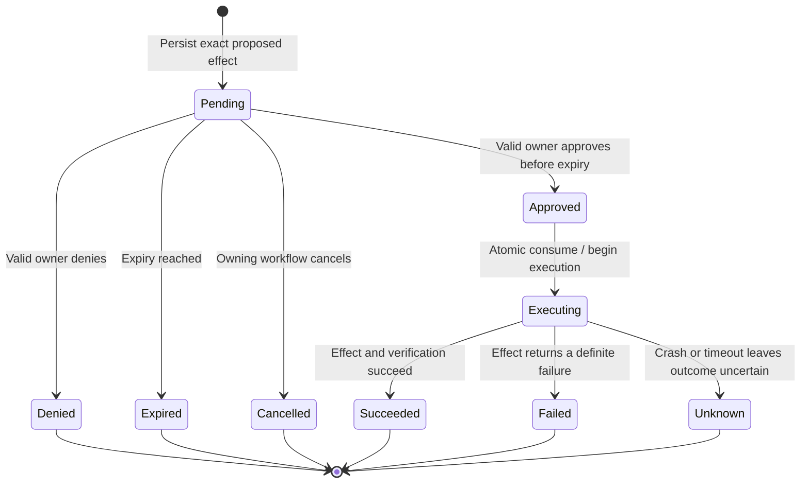

# In-Proxy Multi-Agent Harness Workflows: Follow-up Backlog

> Status: **Future platform work**
>
> Date: 2026-08-08
>
> This is an engineering backlog and sequencing document, not a statement that the APIs proposed
> below already exist. Current supported behavior is documented in
> [In-Proxy Multi-Agent Harness Workflows](multi-agent-harness-workflow.md) and
> [Production Hardening](multi-agent-harness-workflow-prodution-hardening.md).

## Purpose

FabrCore now supports the production-safe first phase of private specialists inside one
`FabrCoreAgentProxy`: first-class creation, scoped/risk-classified tools, bounded execution,
activation cleanup, child attribution, and explicit missing-plan-mode behavior.

The remaining work is primarily about durable coordination around work that outlives one process
turn or can create an external effect. The highest-priority gap is a native human approval round
trip that persists, survives deactivation, works across channels, and cannot be replayed or altered.

This backlog stays inside the existing topology:

- one public FabrCore proxy;
- private in-process `AIAgent` specialists;
- no FabrCore handles or ACL identities for those specialists;
- no proxy-to-proxy A2A protocol;
- concurrent reads and analysis, but ordered and approval-gated effects.

## Current baseline

| Capability | Current status | Follow-up needed |
|---|---|---|
| Internal specialist factory | Shipped | Add host policy ceilings and richer diagnostics |
| Scoped tools and explicit risk | Shipped | Carry risk identity through all wrappers and policy stores |
| Timeout and concurrency bounds | Shipped | Propagate parent cancellation into upstream background tasks |
| Specialist LLM attribution | Shipped | Add provider task IDs and per-specialist usage summaries |
| Harness session persistence | Shipped | Keep approval state and task ledgers independently queryable |
| In-flight task recovery | Tasks restore as `Lost` | Add a durable ledger and safe read-only restart policy |
| Human approval | Application pattern only | Add native, durable, multi-channel approval orchestration |
| External effect evidence | SDK helpers exist | Bind approval, idempotency, effect, and verification into one chain |
| Microsoft Workflows | Application-owned optional dependency | Consider a separate checkpoint adapter only after demand exists |

## Prioritized roadmap

| Priority | Workstream | Depends on | Exit criterion |
|---|---|---|---|
| P0 | Durable approval authority and Harness resumption | Existing Harness snapshots and Microsoft approval binding | No approval-required effect can execute from an unknown, altered, expired, denied, or replayed response |
| P0 | Approval delivery and ingress routing | Principal delivery outbox and authenticated channel ingress | Approval requests and responses survive disconnects and deactivation across REST/WebSocket and at least one durable relay |
| P0 | Effect execution and evidence | Approval authority and verifiable execution | Exact approved arguments, execution attempt, external result, and verification are correlated |
| P1 | Durable internal-task ledger and recovery | Existing lost-task detection | Restarts are deterministic; only declared idempotent reads may restart automatically |
| P1 | Parent cancellation and task callbacks | Microsoft upstream change or FabrCore-owned provider | Parent cancellation, timeout, task ID, and terminal status have one coherent lifecycle |
| P1 | Per-specialist operations and cost | Task callbacks and monitor APIs | Operators can attribute running work, failures, duration, and usage without high-cardinality metrics |
| P2 | Host policy and capability governance | Tool-risk metadata | Code and blueprint values cannot exceed host timeout, concurrency, cost, or effect-risk ceilings |
| P2 | Administration and retention | Approval/task stores | Pending, terminal, expired, unknown, and dead-lettered records are queryable and safely retained |
| P3 | Optional Workflows adapter | Real checkpointed-graph consumers | A separate package persists bounded workflow checkpoints without changing base SDK dependencies |

## P0: durable approval authority

### Design objective

Approval is a persisted state machine, not an agent that blocks while waiting for a person. A run
ends when approval is requested. A later authenticated message records a decision and starts a new
run. The mutation tool remains responsible for validating and atomically consuming approval before
the external effect.



`Unknown` is intentionally terminal for automatic execution. Reconciliation may inspect the
external system using the stored idempotency key, but it must not blindly replay the effect.

### Proposed provider-neutral contracts

Names are illustrative and should be finalized through API review:

```csharp
public interface IFabrCoreApprovalStore
{
    Task<FabrCoreApprovalRequest> CreateAsync(
        FabrCoreApprovalProposal proposal,
        CancellationToken cancellationToken = default);

    Task<FabrCoreApprovalDecisionResult> DecideAsync(
        FabrCoreApprovalDecision decision,
        CancellationToken cancellationToken = default);

    Task<FabrCoreApprovalExecutionLease?> TryBeginExecutionAsync(
        FabrCoreApprovalExecutionAttempt attempt,
        CancellationToken cancellationToken = default);

    Task CompleteExecutionAsync(
        FabrCoreApprovalExecutionCompletion completion,
        CancellationToken cancellationToken = default);
}
```

The persisted request needs at least:

- request ID and schema version;
- owning principal handle and proxy handle;
- Harness thread/session identity;
- stable tool identity, not only the model-visible tool name;
- canonical argument digest and safe human-readable summary;
- encrypted payload or bounded principal-scoped reference needed to reconstruct the exact call;
- tool-risk classification and policy version;
- trace ID and optional originating background-task/todo IDs;
- created/expiry timestamps and current state;
- decision principal, decision time, and decision channel;
- execution attempt, external idempotency key, outcome, and verification reference.

Do not store raw secrets, authorization headers, or unbounded arguments in approval records. Store a
canonical digest plus a protected payload/reference. Canonicalization must be deterministic across
serialization versions and must reject ambiguous numeric, Unicode, property-order, and null/default
representations.

### Security invariants

- Principal identity comes from authenticated ingress context, never from caller-controlled
  `AgentMessage.FromHandle`, `Args`, or model text.
- The response must reference a surfaced request owned by the same principal and proxy/thread.
- The tool identity and canonical argument digest must match exactly.
- `Pending -> Approved/Denied` and `Approved -> Executing` are compare-and-swap transitions.
- Duplicate delivery and duplicate responses are idempotent; conflicting later decisions are rejected.
- Denied, expired, cancelled, consumed, unknown, or mismatched requests execute nothing.
- Approval grants one exact execution unless a separately governed standing rule applies.
- A same-named tool from another scope, plugin version, or proxy is not covered.
- A model cannot manufacture its own approval request or response content.
- Failure after execution begins does not silently return the request to `Approved`.

### Microsoft Agent Framework integration

Use Microsoft's existing `ToolApprovalAgent` and approval-response binding rather than inventing a
second model-facing protocol:

1. Approval-required `AIFunction` calls surface `ToolApprovalRequestContent` and end the run.
2. `FabrCoreHarnessResult` extracts the surfaced request and persists both the Harness session and
   FabrCore approval record before any delivery attempt.
3. A later accepted decision is converted to `ToolApprovalResponseContent` using the stored original
   request—not a tool call supplied by the client.
4. Approval-response binding validates the response against the request restored in the session.
5. The mutation wrapper calls `TryBeginExecutionAsync` immediately before invocation.
6. Completion records definite success/failure or an uncertain outcome, followed by domain verification.

Standing “always approve” rules should be a separate principal policy store scoped by principal,
proxy/agent type, stable tool identity, argument constraint, risk, and expiry. Do not persist a rule
whose authority is only a display name. Unattended approval of mutation tools remains off by default.

## P0: approval delivery and ingress

### Wire contract decision

The older Harness adoption plan proposed `_approval_request` and `_approval_response`. That cannot
be adopted unchanged:

- every underscore-prefixed `MessageType` is currently a FabrCore system message;
- agent chat streams monitor and discard system messages before `OnMessage`;
- the current Microsoft 365 principal relay rejects system messages.

Prefer versioned, platform-reserved non-underscore message types such as:

```text
fabrcore.approval.request.v1
fabrcore.approval.response.v1
fabrcore.approval.cancelled.v1
```

Host ingress must recognize and route these control messages before ordinary agent chat/LLM
handling. They must never appear as untrusted prose in the model transcript. If the platform instead
chooses underscore types, it must first add explicit exceptions to agent stream routing and every
eligible principal relay.

### Delivery behavior

Reuse `SendToUserAsync` and the principal delivery pipeline, but keep approval authority separate
from delivery state:

1. Persist the approval record.
2. Persist/send a structured approval request with a text fallback.
3. Let a live observer receive it immediately or let `PrincipalGrain` move it through the durable
   outbox.
4. Treat outbox delivery as at-least-once. Duplicate cards/messages carry the same request ID.
5. Treat a delivery receipt as proof of transport only, never as approval.
6. Route an authenticated response to `IFabrCoreApprovalStore.DecideAsync`.
7. Wake or invoke the owning proxy with a sanitized control result after the decision is durable.

The outbox's existing lease, retry, endpoint-unavailable, expiration, and dead-letter machinery
should remain generic. Approval-specific expiry may be shorter than message-delivery expiry; an
expired approval card must render as expired even if a delayed delivery later succeeds.

### Channel work

- **REST:** typed request/decision endpoints with authenticated principal binding and idempotency.
- **WebSocket/Surface:** structured events and explicit response operation; reconnect/replay-safe.
- **Microsoft 365/Teams:** Adaptive Card actions with request ID and opaque anti-forgery token; update
  or replace cards after decision/expiry where supported.
- **Offline relays:** provider-neutral fallback text plus deep link when interactive actions are not
  supported.
- **Plain text:** optional only when exactly one pending request is visible in the authenticated
  conversation; ambiguous “approve”/“deny” must be rejected.

## P0: approval-gated effects and evidence

Create an approval-aware function wrapper that composes with `VerifiableExecutionAIFunction` and
preserves stable tool identity/risk metadata through both layers.

Required execution sequence:

1. Recompute the canonical argument digest at invocation.
2. Atomically transition the matching request from `Approved` to `Executing`.
3. Supply the external idempotency key when the provider supports one.
4. Record approval/request linkage before the business call.
5. Execute through `RecordDbEffectAsync`, `RecordHttpCallAsync`, `RecordStorageEffectAsync`, or an
   equivalent transactional outbox/manual evidence API.
6. Verify the domain result independently where practical.
7. Record `Succeeded`, `Failed`, or `Unknown` and return an honest result to the Harness.

Verifiable execution is fail-open for evidence recording today. Product policy must decide whether a
specific high-risk effect requires fail-closed evidence storage. Do not claim that a signed tool-call
record independently proves an external commit; use a transactional outbox, provider receipt, DB
audit marker, version/ETag, or other externally correlated evidence.

## P1: durable internal-task ledger and recovery

The Microsoft background provider deliberately does not serialize live `Task<AgentResponse>` or
private child `AgentSession` instances. Do not attempt to persist those objects. Add a bounded ledger
containing metadata and references:

```csharp
public sealed record InternalAgentTaskRecord
{
    public required string Id { get; init; }
    public required string InternalAgentName { get; init; }
    public required string InputReference { get; init; }
    public required string InputDigest { get; init; }
    public required InternalAgentTaskStatus Status { get; init; }
    public required InternalAgentRecoveryPolicy RecoveryPolicy { get; init; }
    public string? ResultReference { get; init; }
    public string? PriorAttemptId { get; init; }
    public DateTimeOffset CreatedUtc { get; init; }
    public DateTimeOffset UpdatedUtc { get; init; }
}
```

Recovery policies:

| Policy | Behavior after restore |
|---|---|
| `MarkLost` | Default. Persist loss and require an explicit next decision |
| `RestartIdempotentRead` | Validate agent/tool policy and input digest, then start a fresh child session |
| `NeverRestartEffect` | Mandatory for mutation/effect work; reconcile externally instead |

Large inputs and results belong in bounded principal-scoped storage; the ledger stores references and
digests. Restarts create a new attempt linked to the lost attempt. Completed results remain readable,
but private conversational continuation is not promised after activation loss.

## P1: cancellation and provider lifecycle

Request or contribute the following upstream `BackgroundAgentsProvider` capabilities:

- pass the tool-call/parent cancellation token into start and continue operations;
- provider-level maximum concurrency and queue bound;
- per-task timeout;
- task started/terminal callbacks with task ID and agent name;
- explicit abandonment/cancellation semantics;
- a bounded result-size policy.

If upstream cannot provide these semantics, build a FabrCore provider using the same public tool
names so prompts remain portable. Do not run arbitrary background work outside a tracked lifetime.
On proxy disposal, cancel active children, await terminal cleanup within a host ceiling, and mark any
unresolved ledger attempts lost.

## P1: observability and usage accounting

Extend current `internal-agent.task.*` events with:

- provider background-task ID and durable ledger attempt ID;
- parent message/trace/todo identifiers;
- queue wait, run duration, timeout/cancellation category, and persisted-result flag;
- model and per-specialist input/output/reasoning/cached token totals;
- approval request and effect evidence references when applicable.

Keep principal handles, request IDs, task IDs, and endpoints out of metric tags. Put them in traces,
monitor records, or queryable stores. Preserve the response-level aggregate usage totals. Usage that
finishes after a parent response was returned must be recorded as background usage rather than added
retroactively to that response.

## P2: host policy and capability governance

Add immutable host ceilings for:

- proxy-wide and per-specialist concurrency;
- timeout and disposal-drain timeout;
- task queue, prompt, result, ledger, and snapshot sizes;
- per-turn calls/tokens/cost and per-specialist budgets;
- allowed tool-risk classes and standing-approval modes;
- automatic read-task restart count and age.

Configuration precedence should remain: platform-safe defaults, host ceilings, agent args, then code
within those ceilings. Tool risk must survive registry resolution, MCP adaptation, approval wrapping,
and verifiable-execution wrapping. Unknown risk fails closed in production scopes.

## P2: administration, retention, and incident handling

Provide operator APIs and Surface Admin views for:

- pending approvals by principal/proxy without exposing raw arguments;
- approve/deny/revoke/cancel operations with authorization and audit;
- expired, replayed, mismatched, and suspicious response attempts;
- executing/unknown effects requiring reconciliation;
- running/lost/restarted internal tasks;
- approval delivery attempts and dead letters;
- per-specialist latency, failures, and usage.

Define retention separately for approval authority, delivery outbox/dead letters, task ledger,
monitor data, and signed evidence. Deleting monitor records must not delete the authoritative approval
or evidence history. Eviction must define whether pending approvals are cancelled, retained for audit,
or transferred to a tombstone store; they must never remain executable against a deleted proxy.

## P3: optional Microsoft Workflows adapter

Do not add `Microsoft.Agents.AI.Workflows` to `FabrCore.Sdk`. If real applications need deterministic
checkpointed graphs, create a separate version-aligned package such as `FabrCore.Sdk.Workflows` with:

- a FabrCore-backed checkpoint store;
- checkpoint version, size, retention, and corruption policy;
- tracked-client/internal-agent construction helpers;
- approval nodes using the same approval authority;
- trace/evidence correlation with the owning proxy;
- explicit reset, clear-thread, eviction, and rolling-upgrade behavior.

Do not use a workflow checkpoint to imply exactly-once external effects. Effect idempotency and
approval consumption remain separate concerns.

## Test program

### Durable approval

- request persists before live or outbox delivery;
- approve resumes the exact stored call after proxy deactivation;
- deny, expiry, cancellation, wrong principal, wrong proxy/thread, wrong request ID, changed digest,
  unknown tool identity, and replay execute nothing;
- duplicate delivery and duplicate same-decision responses are idempotent;
- conflicting decisions are rejected and audited;
- concurrent approvals produce one `Executing` transition;
- crash before effect, during effect, and after provider success produce deterministic states;
- standing rules cannot authorize a same-named tool from another scope/version;
- delivery through REST/WebSocket and one offline relay produces the same authority outcome.

### Task recovery and load

- silo restart marks in-flight tasks lost before applying recovery policy;
- only `RestartIdempotentRead` work restarts, with a new linked attempt;
- mutation/effect tasks never restart automatically;
- queue/concurrency/timeout/result-size ceilings hold under adversarial repeated calls;
- proxy disposal cancels and drains children without disposing live semaphores/resources early;
- per-specialist and aggregate usage remain consistent under parallel load.

### Evidence and security

- approval, execution, external receipt, and verification share trace/evidence linkage;
- rollback or failed external calls do not leave misleading success evidence;
- secrets and raw sensitive arguments are absent from approval summaries, monitoring, and evidence;
- tampered/reordered evidence fails verification;
- authenticated ingress identity overrides spoofed message fields;
- high-risk fail-closed evidence policy behaves as configured.

## Delivery sequence

1. **Approval contract and state machine** — canonicalization, durable store, CAS transitions, expiry,
   replay protection, and unit tests.
2. **Harness middleware integration** — surface/extract Microsoft requests, persist before return,
   rebuild bound responses, stop/resume semantics, and session restoration tests.
3. **Versioned ingress/delivery contract** — Host routing, REST/WebSocket, durable principal delivery,
   then M365 Adaptive Cards.
4. **Effect wrapper and evidence** — exact digest, execution lease, idempotency/reconciliation,
   verifiable-execution linkage, and domain verification.
5. **Task ledger and provider lifecycle** — upstream contribution or FabrCore provider, safe read-only
   restart, cancellation, result limits, and per-task callbacks.
6. **Operations and policy** — host ceilings, admin/query surfaces, retention, alerts, and load tests.
7. **Optional Workflows package** — only after checkpointed graph consumers justify it.

Do not start with channel UI. The approval authority and exact-effect state machine must be correct
before cards, buttons, or convenience APIs are allowed to trigger it.

## Explicit non-goals

- Turning internal specialists into FabrCore agents or assigning them handles.
- Adding proxy-to-proxy A2A messaging to this topology.
- Blocking an Orleans call, thread, or model run while waiting for a person.
- Allowing concurrent background mutations.
- Automatically replaying an effect after a crash or uncertain outcome.
- Treating outbox delivery, monitor records, prompts, or signed tool-call records as approval.
- Promising exactly-once delivery or exactly-once external mutation.
- Adding Microsoft Workflows to the base SDK dependency graph.

## Definition of done for native durable approval

Native durable approval can be advertised only when:

- approval-required tools are identified by enforceable metadata;
- the exact proposal is persisted before delivery and survives deactivation;
- authenticated responses are bound to owner, proxy/thread, stable tool identity, digest, and expiry;
- approve/deny/replay behavior is atomic and deterministic;
- the Harness resumes through Microsoft's approval binding without trusting client tool arguments;
- live, offline, and duplicate delivery paths preserve the same authority semantics;
- the effect wrapper consumes approval exactly once, handles uncertain outcomes honestly, and verifies
  success before the main agent reports completion;
- evidence and administrative audit link the request, decision, execution, and verification;
- the complete failure/security/load matrix passes.

## Source anchors

| Concern | Source |
|---|---|
| Current internal-agent implementation | [`FabrCoreAgentProxy.InternalAgents.cs`](../src/FabrCore.Sdk/InternalAgents/FabrCoreAgentProxy.InternalAgents.cs) |
| Bounded child runtime | [`BoundedInternalAgent.cs`](../src/FabrCore.Sdk/InternalAgents/BoundedInternalAgent.cs) |
| Native Harness assembly | [`FabrCoreHarnessAgent.cs`](../src/FabrCore.Sdk/Harness/FabrCoreHarnessAgent.cs) |
| Harness session wrapper | [`FabrCoreHarnessResult.cs`](../src/FabrCore.Sdk/Harness/FabrCoreHarnessResult.cs) |
| Current principal delivery contracts | [`PrincipalMessageDelivery.cs`](../src/FabrCore.Core/PrincipalMessageDelivery.cs) |
| Principal pending/outbox lifecycle | [`PrincipalGrain.cs`](../src/FabrCore.Host/Grains/PrincipalGrain.cs) |
| Agent system-message filtering | [`AgentMessage.cs`](../src/FabrCore.Core/AgentMessage.cs) and [`AgentGrain.cs`](../src/FabrCore.Host/Grains/AgentGrain.cs) |
| Current M365 relay eligibility | [`CopilotPrincipalMessageRelay.cs`](../src/FabrCore.Services.Microsoft365Copilot/Bridge/CopilotPrincipalMessageRelay.cs) |
| Verifiable execution contracts | [`VerifiableExecution`](../src/FabrCore.Core/VerifiableExecution) |
| Existing approval design history | [`harness-adoption-plan.md`](harness-adoption-plan.md) |
| Current production status | [`multi-agent-harness-workflow-prodution-hardening.md`](multi-agent-harness-workflow-prodution-hardening.md) |
| Upstream Microsoft approval middleware | `dotnet/src/Microsoft.Agents.AI/Harness/ToolApproval/ToolApprovalAgent.cs` in the Microsoft Agent Framework repository |
| Upstream background runtime | `dotnet/src/Microsoft.Agents.AI/Harness/BackgroundAgents/BackgroundAgentsProvider.cs` in the Microsoft Agent Framework repository |
