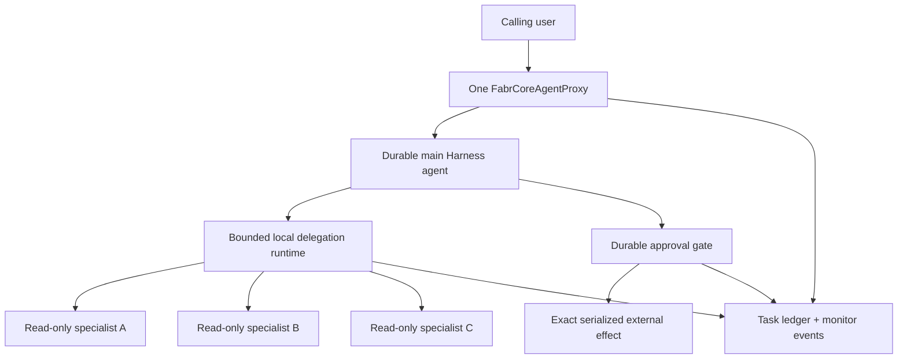

# In-Proxy Multi-Agent Harness Workflows: Production Hardening

> Status: **Proposed**
>
> Date: 2026-08-08
>
> Companion research: [In-Proxy Multi-Agent Harness Workflows](multi-agent-harness-workflow.md)

This document defines the FabrCore hardening needed to treat private, in-process `AIAgent`
specialists inside one `FabrCoreAgentProxy` as a supported production pattern. It does not propose
turning those specialists into FabrCore agents, giving them handles or grains, or routing their work
through FabrCore agent-to-agent messaging.

## Executive decision

The core composition already works:

- a proxy can create separate tracked `IChatClient` wrappers;
- it can construct private `ChatClientAgent` specialists with isolated prompts and tools;
- it can supply those agents through `FabrCoreHarnessOptions.BackgroundAgents`;
- the main Harness session, todos, modes, and completed task records can be persisted;
- LLM usage and run-safety accounting aggregate across child model calls.

That is enough for controlled experiments and read-only applications. It is not yet a complete
production feature for autonomous work because local background tasks lack FabrCore-owned timeout,
cancellation, actor-safety, approval, specialist attribution, and restart policy.

FabrCore should harden the existing topology rather than introduce another multi-agent protocol.

## Fixed architecture boundaries

The following decisions apply to every workstream in this proposal:

1. An internal specialist is an activation-scoped `AIAgent` object, not a FabrCore registry entry.
2. Internal specialists share the owning proxy's principal and security boundary.
3. Internal specialists never call `SendMessage` or `SendAndReceiveMessage` to reach one another.
4. Concurrent specialists gather and analyze. Proxy state changes and ordered external effects stay
   on the main orchestration path or in a separately durable, thread-safe service.
5. Tool/service authorization is enforceable; prompts and agent descriptions are not.
6. A specialist conversation is not durable by default. Durable state belongs to the main Harness
   session, a task ledger, or an application service.
7. A lost or incomplete task is never reported as successful.
8. Microsoft Workflows remains an optional application dependency until FabrCore has a concrete
   need for a checkpoint adapter.



## Production-readiness gates

The pattern is production-ready only when all applicable gates pass:

| Gate | Requirement | Applies to |
|---|---|---|
| Bounded execution | Every local delegation has a timeout, concurrency bound, and terminal status | All internal specialists |
| Actor safety | Concurrent tools cannot mutate proxy state or assume Orleans single-entry execution | All background specialists |
| Capability isolation | Each specialist receives a fresh, validated, narrowly scoped tool set | All specialists |
| Durable approval | Approval-required external effects stop, persist, round-trip to the principal, and resume safely | Any mutation workflow |
| Attribution | LLM calls, tools, duration, failures, and task IDs are visible per specialist | All specialists |
| Recovery | Restart behavior is explicit and idempotent tasks are the only tasks eligible for automatic retry | Durable Harness agents |
| Honest completion | Lost, timed-out, failed, running, and incomplete work is surfaced in the response | All workflows |
| Verification | An external mutation is followed by domain verification before success | Any mutation workflow |

## Current gaps and source evidence

### Local background work is not bounded

Microsoft's `BackgroundAgentsProvider` creates a private session and starts the child with
`Task.Run(() => agent.RunAsync(input, subSession))`. The run does not receive the tool call's
cancellation token and the provider options do not expose a timeout or concurrency limit.

External FabrCore background agents are different: `FabrCoreBackgroundAgent` applies a default
120-second timeout around `SendAndReceiveMessage`. That protection does not apply to ordinary
`AIAgent` instances supplied directly in `FabrCoreHarnessOptions.BackgroundAgents`.

### Local runtime state cannot survive deactivation

Microsoft stores the running `Task<AgentResponse>` and private `AgentSession` in runtime dictionaries
marked `[JsonIgnore]`. After deserialization, running tasks become `Lost`; even completed tasks cannot
continue their old private session after activation loss.

FabrCore correctly reports lost delegations through `DescribeLostDelegations`, but it does not have a
policy for restarting an idempotent local task or preserving its input outside the model transcript.

### Manual specialists miss standard FabrCore composition

`GetChatClient` supplies token tracking and model defaults, but a manually constructed
`ChatClientAgent` does not automatically receive:

- FabrCore's context-compaction provider;
- the standard agent-level OpenTelemetry wrapper;
- a consistent child name/task attribution scope;
- lifecycle registration for role-scoped resources;
- tool-set validation.

`TryCreateContextCompactionProviderAsync` is private, so application code cannot reuse the exact
standard provider when constructing a specialist.

### Tool resolution is proxy-wide

`ResolveConfiguredToolsAsync` resolves the complete plugin/tool/MCP inventory from
`AgentConfiguration`. It does not express “these aliases belong only to the GitHub reader” or
“this specialist may read but may not write.” Developers can resolve subsets through the public
registry and connect MCP servers manually, but doing so bypasses a clear, supported role-scoping API.

### Durable tool approval is not shipped

Microsoft's Harness has tool-approval middleware and anti-forgery response binding. FabrCore's native
Harness deliberately does not yet expose a durable channel round trip. The intended FabrCore design
already exists in `docs/harness-adoption-plan.md`: end the run, persist the surfaced approval, deliver
it through FabrCore channels/outbox, bind a later response, and resume.

### Child usage is aggregated but not identified

`TokenTrackingChatClient` correctly records calls inside the current `LlmUsageScope`. Parallel
children share the owning proxy's handle and normally inherit the same `OriginContext`, so aggregate
cost is visible but the monitor cannot reliably answer which internal specialist incurred it.

### Missing `_plan-mode` forces planning

`FabrCoreHarnessResult.RunAsync(AgentMessage)` initializes `planning = true` and changes mode on every
message. A missing `_plan-mode` therefore selects planning even when
`AgentModeProviderOptions.DefaultMode` is `execute`. Internal action workflows either have to disable
modes, mutate the message args, or use a different overload.

## Workstream 1: first-class internal specialist creation

Add one protected factory on `FabrCoreAgentProxy`. Names below are proposed API shapes, not existing
contracts:

```csharp
protected Task<InternalAgentResult> CreateInternalAgentAsync(
    InternalAgentOptions options,
    CancellationToken cancellationToken = default);

public sealed record InternalAgentOptions
{
    public required string Name { get; init; }
    public required string Description { get; init; }
    public required string Instructions { get; init; }
    public required string Model { get; init; }
    public InternalAgentToolScope? ToolScope { get; init; }
    public IList<AITool>? Tools { get; init; }
    public InternalAgentExecutionPolicy ExecutionPolicy { get; init; }
        = InternalAgentExecutionPolicy.ConcurrentReadOnly;
    public TimeSpan Timeout { get; init; } = TimeSpan.FromSeconds(120);
    public bool EnableContextCompaction { get; init; } = true;
    public bool EnableOpenTelemetry { get; init; } = true;
}

public sealed record InternalAgentResult(
    AIAgent Agent,
    string Name,
    InternalAgentExecutionPolicy ExecutionPolicy,
    TimeSpan Timeout);
```

### Required behavior

The factory must:

1. Validate a non-empty provider-compatible name and non-empty description.
2. Enforce case-insensitive uniqueness within the proxy activation.
3. Resolve a new tracked chat-client wrapper for the configured model.
4. Apply FabrCore's standard context-compaction provider when configured.
5. Apply the standard agent OpenTelemetry wrapper.
6. Establish child attribution containing the main handle and internal agent name.
7. Resolve or accept a fresh tool list and validate duplicate tool names.
8. Register role-scoped disposable resources for proxy cleanup.
9. Return an activation-scoped agent without a FabrCore handle or Orleans history provider.

### Explicit non-behavior

The factory must not:

- register the specialist with `IFabrCoreRegistry`;
- create a new grain or `AgentConfiguration` resource;
- persist the specialist's private conversation automatically;
- grant access to the owning proxy's complete tool inventory;
- infer that a tool is safe based only on its name or description.

## Workstream 2: bounded local delegation

FabrCore needs a wrapper or provider for code-supplied local agents. Reusing
`FabrCoreBackgroundAgent` is inappropriate because that type intentionally sends `AgentMessage`
requests to external FabrCore handles.

### Phase-one implementation

Wrap each internal `AIAgent` in a delegating agent that:

- starts a timeout using `TimeProvider` and a linked cancellation source;
- limits concurrent runs per specialist with a semaphore;
- sets `LlmCallContext`/internal attribution around the entire run;
- records start, completion, failure, cancellation, and timeout monitor events;
- normalizes timeout and cancellation into a model-readable failed result;
- refuses a second concurrent run when the execution policy is serialized;
- forwards `GetService`, session creation, and session serialization correctly.

The default timeout should match external FabrCore delegation: 120 seconds. It must be configurable
per specialist. The initial per-proxy maximum should be configurable with a conservative default;
the runtime must never permit unbounded task creation.

This wrapper can enforce its own timeout even though the upstream provider currently invokes the
agent without a cancellation token. Parent-turn cancellation still requires an upstream fix or a
FabrCore-owned background provider.

### Upstream or phase-two implementation

Request or contribute Microsoft Agent Framework support for:

- cancellation-token injection in `background_agents_start_task` and `continue_task`;
- provider-level maximum concurrency;
- per-task timeout;
- a callback/decorator seam for task attribution.

If upstream cannot provide these semantics on the required schedule, implement a FabrCore-owned
provider using the same public tool names so prompts remain portable.

### Execution policies

Use a small explicit policy set:

| Policy | Allowed behavior |
|---|---|
| `ConcurrentReadOnly` | Thread-safe reads and analysis; no proxy state or external mutation |
| `SerializedReadOnly` | One task at a time for a non-thread-safe read service |
| `OrchestratorOnly` | Agent may be used synchronously by the main path but not as a background agent |

Do not introduce a “concurrent write” policy. Approval-gated effects belong on the main orchestration
path or in a separately durable application actor/service.

## Workstream 3: scoped tools and resource ownership

Add a protected resolver that creates a distinct capability set for one internal specialist:

```csharp
protected Task<InternalAgentToolScope> ResolveInternalAgentToolsAsync(
    InternalAgentToolScopeOptions options,
    CancellationToken cancellationToken = default);

public sealed record InternalAgentToolScopeOptions
{
    public required string ScopeName { get; init; }
    public IReadOnlyList<string> Plugins { get; init; } = [];
    public IReadOnlyList<string> Tools { get; init; } = [];
    public IReadOnlyList<McpServerConfig> McpServers { get; init; } = [];
    public InternalAgentExecutionPolicy ExecutionPolicy { get; init; }
        = InternalAgentExecutionPolicy.ConcurrentReadOnly;
}
```

### Resolver requirements

- Instantiate plugins separately for each scope.
- Connect separate scoped MCP clients and register them for disposal.
- Preserve verifiable-execution wrappers around plugin and standalone-tool calls.
- Reject duplicate effective tool names within a scope.
- Emit a sanitized scope manifest to logs/monitoring without secrets.
- Make the owning internal-agent name available to tool telemetry.
- Fail closed when an explicitly requested alias cannot be resolved. The current proxy-wide helper's
  fail-open MCP behavior is appropriate for optional chat capabilities but too permissive for a
  declared production specialist contract.

### Risk classification

FabrCore should carry explicit tool risk metadata rather than infer risk from descriptions:

| Risk | Meaning | Background use |
|---|---|---|
| Read | No durable external change | Allowed under a read-only execution policy |
| Compute | Pure/local analysis without durable effect | Allowed |
| ApprovalRequired | External or repository mutation that must round-trip to a principal | Main path only |
| SystemOnly | Administrative/platform capability | Never exposed to an internal specialist by default |

The metadata should survive FabrCore's verifiable-execution wrapper and Microsoft approval wrappers.

## Workstream 4: durable approval and mutation resumption

Complete the approval design already sequenced in `docs/harness-adoption-plan.md`. Do not implement an
approval specialist that waits for a human.

### Required lifecycle

1. Microsoft approval middleware surfaces `ToolApprovalRequestContent` and ends the current run.
2. FabrCore binds the request to the owning principal, tool identity, exact serialized arguments,
   request ID, trace, and expiry.
3. The pending request is persisted in the Harness session and proxy custom state before returning.
4. FabrCore sends `_approval_request` through the live observer or durable principal outbox.
5. A later `_approval_response` carries the request ID and decision.
6. The host routes this control message to approval handling rather than ordinary chat delivery.
7. Approval-response binding recreates the correct Microsoft response content and validates it
   against the surfaced request.
8. The Harness resumes; only the originally requested tool call may execute.
9. The approval and external effect are recorded in verifiable execution.

### Security invariants

- No thread, grain call, or model request remains blocked while waiting for the user.
- A response from a different principal is rejected.
- Modified tool arguments require a new approval.
- Expired, denied, consumed, or unknown requests cannot execute.
- “Always approve” rules are scoped to principal, agent, tool identity, and policy—not only tool name.
- Replay is rejected even after grain deactivation.
- Unattended mode is explicit, loudly logged, and disabled by default for mutation tools.
- Failure after consuming approval requires a new approval unless the external service proves the
  operation is safely idempotent and reports its idempotency result.

### Delivery requirements

Approval must work consistently over:

- WebSocket/live Surface observers;
- REST/API clients;
- Microsoft 365/Teams Adaptive Cards;
- durable principal delivery when the user is offline.

The channel formats may differ, but every response binds to the same persisted request contract.

## Workstream 5: internal-agent telemetry

Keep aggregate usage on the final `AgentMessage`, and add a child attribution context for monitor
records and spans.

### Context fields

- `agent.handle`: owning FabrCore handle
- `internal_agent.name`: private specialist name
- `background_task.id`: provider task ID
- `background_task.description`: bounded/sanitized description
- `delegation.kind`: `internal`
- `delegation.parent`: owning handle
- `execution.policy`: internal-agent execution policy
- `llm.origin`: `InternalAgent:{name}`

### Monitor events

Emit at least:

- `internal-agent.task.started`
- `internal-agent.task.completed`
- `internal-agent.task.failed`
- `internal-agent.task.timed-out`
- `internal-agent.task.cancelled`
- `internal-agent.task.lost`
- `internal-agent.task.restarted`

Each terminal event includes duration, model when known, token usage, failure category, and whether a
result was persisted. Payload capture continues to follow the existing monitor redaction settings.

### Usage accounting

`LlmUsageScope` already uses interlocked counters, so concurrent child calls can continue contributing
to the parent total. Add a per-internal-agent accumulator for diagnostics, but do not replace the
existing response-level aggregate keys.

If a task remains running when the parent response is finalized, record its later usage as background
usage and do not silently add it to an already-returned response projection.

## Workstream 6: durable task ledger and recovery

Do not serialize `Task`, cancellation sources, or arbitrary specialist sessions. Persist a small
task descriptor alongside the Harness session:

```csharp
public sealed record InternalAgentTaskRecord
{
    public required string Id { get; init; }
    public required string AgentName { get; init; }
    public required string Description { get; init; }
    public required string InputReference { get; init; }
    public required string InputDigest { get; init; }
    public required InternalAgentTaskStatus Status { get; init; }
    public required InternalAgentRecoveryPolicy RecoveryPolicy { get; init; }
    public string? IdempotencyKey { get; init; }
    public string? ResultReference { get; init; }
    public string? Error { get; init; }
    public DateTimeOffset CreatedUtc { get; init; }
    public DateTimeOffset UpdatedUtc { get; init; }
}
```

Large inputs/results should live in principal-scoped storage; the ledger stores a reference and digest,
not an unbounded payload in the grain state blob.

### Recovery policies

| Policy | Restore behavior |
|---|---|
| `MarkLost` | Default. Report loss and require the orchestrator/user to choose what happens next |
| `RestartIdempotentRead` | Recreate a fresh specialist session and restart only after validating input digest and policy |
| `NeverRestartEffect` | Mandatory for approval-required or externally mutating tasks |

Automatic restart must never apply to a mutation merely because the tool claims to be idempotent.
The external service must accept and enforce an idempotency key, and FabrCore must retain the outcome.

### Snapshot interaction

- The Harness snapshot remains the owner of todos, modes, and provider state.
- The task ledger records recoverable work metadata and terminal results.
- Completed-task results remain readable after restart.
- In-flight runtime tasks become lost before any restart decision.
- Restarts create new runtime task IDs linked to the prior ledger record.

## Workstream 7: Harness mode semantics

Add an explicit option controlling what `RunAsync(AgentMessage)` does when `_plan-mode` is absent:

```csharp
public enum MissingPlanModeBehavior
{
    SelectPlanning,       // Current behavior; default for compatibility.
    PreserveCurrentMode,  // Honor session/default mode.
    SelectExecution
}
```

The existing behavior remains the default. Internal action workflows can select
`PreserveCurrentMode` without disabling modes or rewriting inbound message args. Invalid explicit
values should continue to use a documented fallback and produce a diagnostic.

## Workstream 8: optional Microsoft Workflows integration

Do not add `Microsoft.Agents.AI.Workflows` to `FabrCore.Sdk` as part of the initial hardening. The
Harness background-agent pattern already covers model-directed delegation.

If deterministic graph adoption becomes common, add a separate optional package such as
`FabrCore.Sdk.Workflows` that provides:

- a FabrCore-backed workflow checkpoint store;
- workflow-as-agent construction using tracked chat clients;
- trace and monitor correlation with the owning proxy;
- checkpoint size and retention limits;
- explicit behavior for grain reset, thread clear, and eviction.

Keep the optional package version-aligned with Microsoft Agent Framework and prevent it from changing
the base SDK dependency surface.

## Configuration model

The first release should keep internal specialists code-defined. They are implementation details of a
proxy class, and a generic blueprint schema would prematurely turn them into host-managed entities.

Allow ordinary `AgentConfiguration.Args` to tune safe values such as model name, timeout, and maximum
concurrency. Reserve a structured blueprint shape for a later release only if multiple agent classes
need the same reusable internal roster.

Recommended configuration precedence:

1. Platform-safe defaults
2. Model configuration and host limits
3. Agent `Args`
4. Code callback, within immutable host safety ceilings

Code must not be able to raise timeout, concurrency, or budget above a host-enforced maximum without
an explicit host policy.

## Security model

### Principal and ACL boundary

Internal specialists execute on behalf of the owning proxy's principal. They do not receive separate
ACL identities. A workflow needing an independently governed identity must use an external FabrCore
agent instead.

### Indirect prompt injection

Results from GitHub, CRM, tickets, files, or another specialist are untrusted model input. Require:

- data/instruction separation in specialist prompts;
- structured outputs for identifiers and proposed effects;
- scope and authorization checks inside tools/services;
- no mutation based solely on specialist prose;
- bounded result size and redaction of secrets;
- approval over exact serialized effect arguments.

### External effects

Every important effect should flow through `VerifiableExecutionAIFunction` or the corresponding
FabrCore verifiable-execution helper. Evidence should identify the owning handle, internal specialist
or main orchestrator, approval request, tool, input digest, and external idempotency key.

## Testing strategy

### Unit tests

- Internal names reject empty and case-insensitive duplicates.
- Scoped tool resolution produces new plugin instances per specialist.
- A read-only scope cannot contain approval-required/system-only tools.
- Timeout produces one terminal status and releases its concurrency permit.
- Serialized policy never overlaps runs.
- Decorators forward `GetService`, session creation, and serialization.
- Child attribution survives async/`Task.Run` execution.
- Missing-plan-mode behavior matches each configured enum value.

### Harness integration tests

- Two read-only specialists run concurrently and both results reach the main agent.
- Per-specialist and aggregate token accounting agree.
- Iteration-budget exhaustion reports running/incomplete work.
- Deactivation marks an in-flight task lost.
- An idempotent read task restarts only under `RestartIdempotentRead`.
- A mutation task never restarts automatically.
- Completed task results survive restore while private sessions do not.
- Scoped MCP clients are disposed on deactivation/reconfigure.

### Approval tests

- Approval request ends the turn and is persisted before delivery.
- Approve resumes and executes the exact bound call.
- Deny, expiry, wrong principal, wrong request ID, changed arguments, and replay do not execute.
- Offline delivery uses the principal outbox and resumes after reactivation.
- Failure after approval is reported and cannot silently retry.
- “Always approve” rules cannot authorize a same-named tool from another scope.

### Failure and load tests

- Provider cancellation, timeout, and network hangs do not strand the proxy indefinitely.
- Maximum concurrency is enforced under adversarial repeated tool calls.
- Large specialist results cannot overflow the Harness snapshot limit.
- Parallel usage accounting remains consistent.
- A silo restart during fan-out produces deterministic lost/restart behavior.
- Monitor payload redaction applies to delegated prompts and results.

## Delivery sequence

### Phase 0: conformance baseline

- Add tests proving today's code-supplied `BackgroundAgents` behavior.
- Record cancellation, timeout, deactivation, usage, and mode-default behavior as executable tests.
- Keep the companion research document as the topology contract.

### Phase 1: safe read-only specialists

- Add `CreateInternalAgentAsync` and scoped tool resolution.
- Add timeout/concurrency wrappers and execution policies.
- Add per-specialist attribution and monitor events.
- Ship a read-only PR-review sample.

Exit criterion: multiple private read-only specialists can run concurrently without unbounded work,
proxy-state mutation, capability leakage, or invisible cost.

### Phase 2: durable approval and effects

- Complete Harness approval middleware integration and response binding.
- Add channel/outbox delivery and persisted pending requests.
- Bind verifiable-execution evidence and external idempotency.
- Extend the sample with approval-gated workspace changes.

Exit criterion: no mutation can occur without a valid current approval, and approval survives grain
deactivation without blocking a turn.

### Phase 3: recovery and mode ergonomics

- Add the internal task ledger and recovery policies.
- Add `MissingPlanModeBehavior`.
- Add operational dashboards for internal task state and cost.

Exit criterion: restart outcomes are deterministic, observable, and never replay external effects.

### Phase 4: optional deterministic workflows

- Evaluate real consumers of Microsoft Workflows.
- Add a separate adapter package only if checkpointed graph execution is required.

## Definition of done

FabrCore may describe in-proxy multi-agent workflows as production-ready when:

- application developers use a supported internal-agent factory rather than reconstructing the
  standard FabrCore pipeline manually;
- every local background run is bounded and attributed;
- every specialist receives an isolated tool scope with fresh resources;
- background tools cannot mutate proxy state under an undocumented concurrency assumption;
- approval-required effects use the durable FabrCore approval round trip;
- lost and restarted tasks follow explicit recovery policy;
- final responses expose incomplete work and verification failures;
- monitor data separates child activity while preserving parent aggregate cost;
- the full test matrix passes under cancellation, timeout, deactivation, and parallel load.

## Source anchors

| Concern | Source |
|---|---|
| Tracked client and standard agent factory | [`FabrCoreAgentProxy.cs`](../src/FabrCore.Sdk/FabrCoreAgentProxy.cs) |
| Native Harness creation | [`FabrCoreAgentProxy.Harness.cs`](../src/FabrCore.Sdk/Harness/FabrCoreAgentProxy.Harness.cs) |
| Code-supplied background-agent options | [`FabrCoreHarnessOptions.cs`](../src/FabrCore.Sdk/Harness/FabrCoreHarnessOptions.cs) |
| Harness snapshots, modes, todos, and lost-delegation diagnostics | [`FabrCoreHarnessResult.cs`](../src/FabrCore.Sdk/Harness/FabrCoreHarnessResult.cs) |
| External FabrCore delegation timeout | [`FabrCoreBackgroundAgent.cs`](../src/FabrCore.Sdk/Harness/FabrCoreBackgroundAgent.cs) |
| Tool/plugin resolution | [`FabrCoreToolRegistry.cs`](../src/FabrCore.Sdk/FabrCoreToolRegistry.cs) |
| LLM usage and origin attribution | [`TokenTrackingChatClient.cs`](../src/FabrCore.Sdk/TokenTrackingChatClient.cs) |
| Existing durable-approval design | [`harness-adoption-plan.md`](harness-adoption-plan.md) |
| Upstream local task execution | `dotnet/src/Microsoft.Agents.AI/Harness/BackgroundAgents/BackgroundAgentsProvider.cs` in the Microsoft Agent Framework repository |
| Upstream non-serializable task/session state | `dotnet/src/Microsoft.Agents.AI/Harness/BackgroundAgents/BackgroundAgentRuntimeState.cs` in the Microsoft Agent Framework repository |

## Final recommendation

Do not redesign FabrCore around private subagents. Preserve one public proxy and strengthen the seam
where it creates and delegates to internal `AIAgent` objects.

The minimum credible production investment is:

1. bounded local execution with explicit actor-safety policy;
2. first-class internal-agent and scoped-tool factories;
3. durable approval for all external effects;
4. per-specialist monitoring and deterministic lost-task behavior.

Everything else—including a Microsoft Workflows adapter or declarative internal rosters—should wait
until those safety and lifecycle fundamentals are proven by real consumers.
