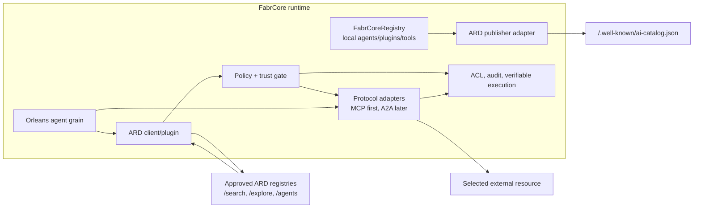

# Agentic Resource Discovery (ARD) and FabrCore

## Research report and integration recommendation

**Research date:** July 14, 2026  
**ARD source reviewed:** `ards-project/ard-spec` at commit [`afd447d88ed165427687d8af37e8d42398552b56`](https://github.com/ards-project/ard-spec/tree/afd447d88ed165427687d8af37e8d42398552b56)  
**FabrCore source reviewed:** local repository at commit `03f8e45428e0a17a693ad7432a0109c9e057b9e9`  
**ARD status at review:** v0.9, draft/proposal

## Executive summary

ARD is a strong strategic fit for FabrCore. FabrCore already knows how to discover agent classes, plugins, standalone tools, and configured MCP servers inside a running host. ARD adds the missing outward-facing layer: a standard way to publish those capabilities, search much larger approved collections by intent, federate across registries, and return only the few resources relevant to a task.

The recommended direction is a **conditional adoption**:

1. Add ARD as an optional integration package, not as a replacement for FabrCore's registry, agent handles, Orleans messaging, ACLs, or MCP execution.
2. Start with two low-risk capabilities:
   - publish an ARD `ai-catalog.json` projection of explicitly approved FabrCore resources;
   - let FabrCore agents perform read-only searches against operator-approved ARD registries.
3. Add controlled MCP activation only after a trust and policy gate, explicit approval, SSRF protections, and an artifact-specific adapter are in place.
4. Consider operating a full FabrCore ARD registry only after the publisher and client paths prove useful.
5. Pin support to a tested ARD commit/profile until the draft reaches a stable release. Do not claim generic “ARD-compatible” behavior without stating the supported profile.

The best architectural framing is:

> **FabrCore remains the durable execution and governance platform; ARD becomes its portable discovery plane.**

This approach offers meaningful benefits: less hardcoded capability configuration, smaller model context, cross-client portability, enterprise-curated discovery, a path to expose FabrCore agents to external ecosystems, and a standards-based on-ramp to MCP/A2A/Skill catalogs. It also preserves the platform's strongest properties—Orleans isolation, per-agent tool instances, ACL enforcement, state, monitoring, and verifiable execution.

## Research scope

This review covered the complete ARD repository content relevant at the pinned commit:

- repository home, license, ownership, and CI workflow;
- the 788-line [normative ARD specification](https://github.com/ards-project/ard-spec/blob/afd447d88ed165427687d8af37e8d42398552b56/spec/ard.md);
- the [URN naming guide](https://github.com/ards-project/ard-spec/blob/afd447d88ed165427687d8af37e8d42398552b56/spec/urn-naming-guide.md);
- all formal schemas: [CDDL](https://github.com/ards-project/ard-spec/blob/afd447d88ed165427687d8af37e8d42398552b56/spec/schemas/ard.cddl), [JSON Schema](https://github.com/ards-project/ard-spec/blob/afd447d88ed165427687d8af37e8d42398552b56/spec/schemas/ai-catalog.schema.json), and [OpenAPI](https://github.com/ards-project/ard-spec/blob/afd447d88ed165427687d8af37e8d42398552b56/spec/schemas/ard.openapi.yaml);
- all nine [architecture decision records](https://github.com/ards-project/ard-spec/tree/afd447d88ed165427687d8af37e8d42398552b56/adr);
- the official [conformance tool, examples, mock registry, and instructions](https://github.com/ards-project/ard-spec/tree/afd447d88ed165427687d8af37e8d42398552b56/conformance);
- every page in the official site's navigation as of the research date: home, getting started, introduction, operation, interoperability, contributors, FAQ, glossary, chatbot connectors for five clients, publishing, client integration, reference implementations, ARD specification, and AI Catalog overview;
- the upstream [AI Catalog project](https://github.com/Agent-Card/ai-catalog) and current [AI Catalog documentation](https://ai-catalog.io/);
- public implementation evidence from the official ARD reference-implementation page and primary announcements by [Microsoft](https://commandline.microsoft.com/agentic-resource-discovery-specification-ard/) and [Hugging Face](https://huggingface.co/blog/agentic-resource-discovery-launch).

On the FabrCore side, the review traced the runtime registry and discovery API, agent configuration, plugin/tool resolution, MCP connection lifecycle, embeddings and vector-search implementation, ACL engine, agent reconfiguration path, and verifiable-execution interfaces.

## What ARD is

ARD standardizes the step before invocation. A client describes a task to a discovery service; the service returns ranked catalog entries describing potentially useful resources. The selected resource is then invoked through its own protocol, such as MCP, A2A, a Skill loader, OpenAPI, or a vendor-specific adapter. ARD does not define the execution protocol.

The official site describes this as the difference between choosing among already-known tools and deciding which tools should become known to the client in the first place. It also explicitly supports both build-time and runtime discovery, and both closed enterprise catalogs and open-web indexes—not only autonomous runtime search. See the official [introduction](https://agenticresourcediscovery.org/introduction/), [interoperability explanation](https://agenticresourcediscovery.org/interoperability/), and [FAQ](https://agenticresourcediscovery.org/faq/).

### Core roles and flow

1. **Publisher:** hosts an `ai-catalog.json`, normally at `https://<domain>/.well-known/ai-catalog.json`.
2. **Catalog entry:** describes one artifact with a stable identifier, media type, and exactly one of an external `url` or inline `data`.
3. **Registry/discovery service:** crawls or ingests catalogs, indexes entries, and exposes the ARD HTTP API.
4. **Client/orchestrator:** sends task intent and structured filters to the registry.
5. **Verifier/policy layer:** evaluates publisher identity, provenance, attestations, signatures, organizational policy, and user authority.
6. **Protocol adapter/runtime:** fetches and invokes the selected artifact using its native mechanism.

### Catalog data model

The current ARD profile builds on AI Catalog 1.0. A manifest contains `specVersion`, optional `host`, and `entries`. Each entry requires:

- a domain-anchored `urn:air:` identifier;
- `displayName`;
- an artifact media `type`;
- exactly one of `url` or `data`.

Optional discovery signals include `description`, `tags`, `capabilities`, two to five `representativeQueries`, `version`, `updatedAt`, extension metadata, and a `trustManifest`. Nested catalogs use the `application/ai-catalog+json` media type. The current AI Catalog site shows the same typed, nestable, value-or-reference model in its [overview](https://ai-catalog.io/).

The identifier is deliberately separate from the resource's network location and security principal:

```text
urn:air:<publisher-domain>:<optional-namespace...>:<resource-name>
```

This is a useful match for FabrCore: a stable ARD URN can coexist with a FabrCore type alias, an instantiated `principal:agent` handle, an endpoint URL, and a SPIFFE/DID identity without pretending that those are the same thing.

### Registry API

The required operation is `POST /search`. Optional operations are `POST /explore` and `GET /agents`.

- `POST /search` accepts a required natural-language `query.text`, optional structured `query.filter`, root-level federation control, and token pagination. Results contain catalog-entry fields plus a 0–100 relevance `score` and source registry URL.
- `POST /explore` returns local facet aggregations rather than ranked entries. It does not federate.
- `GET /agents` provides deterministic listing with filters, ordering, and pagination.

ARD defines three federation modes:

- `none`: search only the queried registry;
- `referrals`: return local results and other registries the client may choose to query;
- `auto`: let the registry query upstream sources and merge the results.

The spec repeatedly warns that search score is relevance only. It is not a trust, compliance, quality, or safety score.

### Trust boundaries

ARD can carry identity, attestations, provenance, and a detached signature in `trustManifest`, but it does not make a resource safe or trustworthy. The registry decides what it indexes, and the client decides what evidence is sufficient before invocation. Authentication to the actual resource is delegated to that resource's native protocol. The official [FAQ trust section](https://agenticresourcediscovery.org/faq/#where-does-trust-come-from-in-ard) is especially clear on this boundary.

This distinction is central to a safe FabrCore integration:

- discovery is not authorization;
- a domain-anchored URN is not proof of domain control;
- a relevance score is not an execution approval;
- finding an MCP card is not the same as safely connecting to its endpoint;
- catalog metadata must never carry runtime credentials.

## Maturity and specification quality

ARD has credible industry momentum. The official site lists contributors from Cisco, Databricks, GitHub, GoDaddy, Google, Hugging Face, Microsoft, NVIDIA, Salesforce, ServiceNow, and Snowflake. The official reference page identifies working discovery surfaces from Hugging Face, GitHub, Cisco/AGNTCY, and Ora. Microsoft describes ARD as the common publishing/indexing/discovery layer and GitHub Agent Finder as a live ARD-based capability; Hugging Face documents a working REST and MCP search implementation.

That momentum does not yet make the specification stable. The repository labels v0.9 as a draft/proposal and has no published GitHub release. More importantly, the repository and documentation contain observable version drift.

| Area | Observation | Consequence for FabrCore |
|---|---|---|
| Versioning | The main spec says v0.9, while the OpenAPI document and conformance CLI still identify as v0.5.0; the mock registry header says v0.4. | Pin a commit and maintain an explicit compatibility profile. |
| URN namespace | The current spec, schemas, and ADR-0009 use `urn:air:`. Several official FAQ, glossary, client-guide, AI Catalog, and older ADR examples still use `urn:ai:`. | Emit and accept `urn:air:` for the pinned profile; optionally diagnose legacy input, but do not publish it. |
| MCP media type | ADR-0008 and current schemas use `application/mcp-server-card+json`; several site examples and vendor material retain `application/mcp-server+json`. | Normalize only at a compatibility boundary and retain the original value for audit. |
| Catalog hierarchy | The pinned schema models nested catalogs as entries and the conformance code rejects a root `collections` field. The official ARD AI Catalog page still documents root `collections`. The conformance README attributes that removal to ADR-0003, but ADR-0003 actually concerns RFC 2606 placeholder domains. | Treat the pinned schema—not prose copied between pages—as the validation source. |
| Trust schema | The prose attestation table lists `type`, `uri`, and optional `digest`; the JSON Schema and CDDL also require `mediaType`. JSON Schema defines a `trustSchema` object not represented in the main prose/CDDL. | Preserve unknown fields and validate against the pinned JSON Schema; do not hand-code only the prose table. |
| Cardinality | CDDL requires one or more manifest entries/results/buckets in places where JSON Schema/OpenAPI permit empty arrays. | Decide and document FabrCore's behavior; empty search results must remain valid operationally. |
| Search constraints | The prose says search page size has a maximum of 100; OpenAPI does not apply that maximum to `SearchRequest.pageSize`. | Enforce the prose limit in the pinned profile and test it explicitly. |
| Conformance depth | Strict JSON Schema checking is skipped when Python `jsonschema` is absent. Some semantic deviations are warnings, and the mock registry ignores important request semantics while still passing the probe suite. The CLI's Unicode status output also failed under the default Windows CP-1252 console during this review and required `PYTHONUTF8=1`. | Run the tool with `jsonschema` and explicit UTF-8 (or in its Linux CI environment), but supplement it with FabrCore contract, behavior, and security tests. A green official probe is necessary, not sufficient. |

This is normal for an early, actively changing standard, but it argues strongly for an experimental package and feature flag rather than immediate core coupling.

## FabrCore's current discovery and execution model

FabrCore already contains most of the building blocks needed for an ARD adapter.

### Existing local registry

[`FabrCoreRegistry`](../../src/FabrCore.Sdk/FabrCoreRegistry.cs#L7) scans loaded assemblies for `[AgentAlias]`, `[PluginAlias]`, and `[ToolAlias]`. It exposes aliases, descriptions, capability text, notes, plugin/tool method descriptions, hidden-resource filtering, and alias-collision diagnostics. [`DiscoveryController`](../../src/FabrCore.Host/Api/Controllers/DiscoveryController.cs#L8) returns that registry through `GET /fabrcoreapi/Discovery`.

This is highly reusable for ARD publication, but it is not itself an ARD registry:

- it is local to a host and reflection-based;
- it lists implementation types rather than globally identified deployed artifacts;
- it has no `ai-catalog.json` projection;
- it has no representative queries, tags, versions, update timestamps, URL/data artifact binding, or trust manifest;
- it has no semantic `POST /search`, facets, pagination, ingestion, or federation;
- an alias collision is resolved locally, whereas ARD requires stable globally unique identifiers.

### Static capability configuration and MCP

[`AgentConfiguration`](../../src/FabrCore.Core/AgentConfiguration.cs#L5) contains explicit `Plugins`, `Tools`, and `McpServers` lists. At initialization, [`ResolveConfiguredToolsAsync`](../../src/FabrCore.Sdk/FabrCoreAgentProxy.cs#L380) resolves local plugin/tool aliases and connects every configured MCP server. Config-driven MCP failures are fail-open: they are logged and the agent continues without those tools.

[`McpServerConfig`](../../src/FabrCore.Core/McpServerConfig.cs#L11) supports stdio and HTTP transports, commands/arguments, URLs, environment variables, and headers. This makes MCP the shortest path from ARD discovery to FabrCore invocation. It still requires an adapter: in ARD, an entry URL normally points to an MCP **server card**, not necessarily to the live MCP transport endpoint expected by `McpServerConfig.Url`.

Local FabrCore plugins and standalone tools are different. They are in-process code discovered from installed assemblies. Publishing a plugin or tool entry does not make its code remotely invokable or distributable. Such resources should be:

- published only to a private/build-time catalog with package/install metadata; or
- exposed behind an invokable protocol such as MCP/OpenAPI before being advertised for runtime discovery.

### Embeddings and search foundation

FabrCore registers [`IEmbeddings`](../../src/FabrCore.Sdk/Embeddings.cs#L5). Its memory subsystem already demonstrates SQL Server vector storage, cosine similarity, keyword search, and reciprocal-rank fusion in [`SqlServerMemoryStore`](../../src/FabrCore.Sdk/Memory/SqlServerMemoryStore.cs#L9). These are useful implementation patterns for ARD semantic search.

The existing memory store should not be reused directly as the catalog index. It lacks ARD entry structure, publisher/source state, filters, versioning, tenant/policy partitions, and ingestion lifecycle. Reuse `IEmbeddings` and the hybrid-search approach; create a dedicated ARD index abstraction and schema.

### Governance foundations

FabrCore's ACL engine defaults to enforced, explicitly denies cross-principal access unless granted, supports roles and groups, and permits applications to define additional action names. See [`FabrCoreAclOptions`](../../src/FabrCore.Core/Acl/FabrCoreAclOptions.cs#L22), [`AclEvaluator`](../../src/FabrCore.Host/Services/AclEvaluator.cs#L13), and [`FabrPermissions`](../../src/FabrCore.Core/Acl/FabrPermissions.cs#L5). ARD can add actions such as `ard.search`, `ard.inspect`, `ard.attach`, and `ard.invoke` without changing the permission-name model.

FabrCore also has pluggable verifiable-execution stores, signers, and verification, including SPIFFE-aware identity/trust enums and options. See [`IVerifiableExecutionSigner`](../../src/FabrCore.Core/VerifiableExecution/VerifiableExecutionInterfaces.cs#L22) and [`VerifiableExecutionOptions`](../../src/FabrCore.Host/Configuration/VerifiableExecutionOptions.cs#L5). This is complementary to ARD trust but not interchangeable with it:

- FabrCore verifiable execution proves and records what happened during an execution trace;
- ARD trust verification evaluates whether a discovered catalog claim should be accepted before connecting.

A separate `IArdTrustVerifier` should validate catalog identity/signature/provenance. Accepted resource selection and subsequent calls can then be recorded through FabrCore's existing verifiable-execution context.

## Fit assessment

| ARD capability | FabrCore fit | Existing foundation | Main gap |
|---|---:|---|---|
| Publish a host catalog | High | Runtime registry, metadata attributes, hidden-resource filter, HTTP host | ARD models, stable URNs, routable artifact cards, structured metadata, trust manifest |
| Search external registries | High | HTTP/MCP clients, plugin model, per-agent DI, agent sessions | ARD client, validation, allowlists, policy/trust workflow |
| Dynamically use discovered MCP | High with controls | HTTP MCP transport and automatic tool conversion | Server-card adapter, approval, safe fetch, lifecycle/cache, secrets |
| Discover/use external A2A agents | Medium | Agent orchestration and message abstractions | No reviewed A2A protocol adapter or A2A card/runtime bridge |
| Publish FabrCore agents externally | Medium-high | Hosted agents, REST/WebSocket surfaces, registry metadata | Standard external card and invocation protocol; A2A is the natural candidate |
| Publish in-process plugins/tools | Medium at build time; low at runtime | Rich reflection metadata | Distribution/install model or remote protocol wrapper |
| Operate an ARD registry | Medium-high | Orleans, persistence patterns, embeddings, SQL vector-search example, hosting APIs | Ingestion, dedicated index, filters/facets, ranking, federation, source governance |
| ARD identity/trust verification | Medium | ACLs, audit, signing/verifiable execution, SPIFFE-aware contracts | Domain binding, DID/JWS resolution, catalog provenance policy, attestation verification |
| Full auto-discovery and auto-install | Low initially | Agent reconfiguration exists | Safety model, operator consent, sandboxing, rollback, supply-chain controls |

Overall fit is **high for publication and read-only discovery**, **high for controlled MCP use**, and **moderate for a full registry or cross-protocol autonomous execution**.

## Recommended architecture

ARD should be implemented as a separate optional package—provisionally `FabrCore.Ard`—while the draft is evolving.



### 1. Publisher adapter

Add a projection service that converts explicitly approved `RegistryEntry` records and deployment descriptors into AI Catalog entries.

Recommended components:

- `ArdPublisherOptions`: publisher domain, host identity, catalog path, default metadata, public/private mode, and inclusion policy;
- `IArdCatalogProjection`: converts local registry/deployment records to ARD entries;
- `IArdCatalogSigner`: optional manifest/trust signing integration;
- a well-known endpoint at `/.well-known/ai-catalog.json`;
- optional `application/ai-registry+json` entry advertising a FabrCore-hosted ARD registry base URL;
- ETag/cache headers and deterministic serialization;
- a validation step against the pinned JSON Schema before serving.

Do not expose every item returned by the current Discovery API. Publication must be opt-in or policy-filtered. `FabrCoreHidden` should remain an unconditional exclusion. Public entries must identify a genuinely retrievable artifact card or embedded artifact, not only a CLR type name.

Suggested metadata additions:

- repeatable structured capability attribute rather than parsing the current free-text `FabrCoreCapabilities` string;
- repeatable representative-query attribute;
- artifact media type and card URL/data binding;
- version and updated-at provider;
- optional tags and extension metadata;
- publisher trust configuration supplied by the host, not by arbitrary plugin code.

### 2. ARD client and agent-facing discovery plugin

Add a typed `IArdDiscoveryClient` for `search`, `explore`, and list operations. Wrap it in an `ArdDiscoveryPlugin` that exposes small, model-friendly functions such as:

- `search_resources(intent, types, capabilities, pageSize)`;
- `inspect_resource(identifier)`;
- `request_resource_attachment(identifier)`.

The client should query only configured endpoints. Default federation should be `none` or `referrals`; `auto` should require explicit operator enablement. Cache results by normalized query, filters, registry, policy identity, and registry ETag/TTL to avoid adding a network/vector-search round trip to every model turn.

Read-only search is immediately useful even before dynamic attachment. An agent can recommend a resource, return its documentation, or create a proposed configuration change for review.

### 3. Policy and trust gate

Every transition from “discovered” to “retrieved, attached, or invoked” should pass a deterministic gate outside the model.

Recommended interfaces:

- `IArdRegistryPolicy`: which registries/federation modes a principal may use;
- `IArdResourcePolicy`: allowed publishers, media types, protocols, versions, regions, costs, and attestations;
- `IArdTrustVerifier`: URN/domain binding, DID/SPIFFE/HTTPS identity verification, detached signature validation, provenance, and attestation handling;
- `IArdFetchPolicy`: URL scheme, DNS/IP range, redirect, size, timeout, and content-type constraints;
- `IArdApprovalService`: optional human/operator approval before attachment or invocation.

Map these decisions into FabrCore ACL actions. Record the selected entry digest, registry source, trust outcome, approval, adapter, and downstream side effects through audit and verifiable execution.

### 4. Protocol adapters

Define `IArdResourceAdapter` keyed by media type. Each adapter should implement inspect/validate/connect behavior without asking the LLM to translate arbitrary catalog data into executable configuration.

The first adapter should support `application/mcp-server-card+json`:

1. Fetch the card through the safe fetcher.
2. Validate the card and policy.
3. Extract its live transport endpoint and authentication requirements.
4. Resolve credentials through FabrCore/host secret services; never copy secrets from catalog metadata.
5. Construct an `McpServerConfig` or connect through a scoped MCP broker.
6. Keep the resulting MCP client scoped to the agent and dispose it on deactivation.

Two activation patterns are possible:

- **Broker pattern (recommended first):** a stable discovery/invocation plugin connects to selected resources on demand. This avoids rebuilding the model agent whenever the tool set changes.
- **Reconfiguration pattern:** after approval, persist a translated `McpServerConfig`, set `ForceReconfigure`, and reactivate/reinitialize the agent. This makes the capability durable but causes a heavier lifecycle transition and requires rollback handling.

FabrCore should not load arbitrary discovered assemblies into the host at runtime. In-process plugin/tool discovery belongs in a signed package/install workflow and should remain a separate, much higher-trust feature.

### 5. Optional FabrCore ARD registry

A later phase can turn FabrCore into an enterprise discovery service:

- source configuration and allowlists;
- catalog crawling with HTTPS, ETag/Last-Modified, refresh TTL, backoff, and deletion/tombstone handling;
- schema validation and normalization into a canonical stored record;
- dedicated structured index plus embeddings of description, capabilities, tags, and representative queries;
- `POST /search`, optional local `POST /explore`, and optional `GET /agents` under a versioned base path;
- policy-aware result filtering before ranking/return;
- controlled federation and referral-loop detection;
- source and normalization provenance retained on every record.

Orleans is useful for coordinating source refreshes, ownership, timers/reminders, and partitioned state. The large searchable/vector index should live in a dedicated store, not grain state. Reuse `IEmbeddings` and the hybrid ranking pattern; define an `IArdIndexStore` suited to structured filters, vector retrieval, facets, and tenant isolation.

## Resource mapping

| FabrCore concept | ARD representation | Notes |
|---|---|---|
| Agent type alias | Part of a deployment-owned `urn:air:<domain>:fabrcore:agent:<alias>` | ARD URN must not replace the runtime `principal:agent` handle. |
| Deployed FabrCore agent | A2A agent card if an A2A adapter exists; otherwise a registered vendor media type/card | Do not label a proprietary endpoint as A2A without implementing A2A. |
| Configured remote MCP server | `application/mcp-server-card+json` | Entry points to a descriptor card; adapter extracts the live MCP endpoint. |
| FabrCore plugin | Private/build-time catalog entry or remotely wrapped artifact | In-process code is not remotely invokable merely because it is cataloged. |
| Standalone tool | Private/build-time entry, nested package catalog, or MCP/OpenAPI wrapper | Publication needs a delivery/install or invocation mechanism. |
| Existing Discovery API | Source for publisher projection and local diagnostics | Keep it; do not force ARD response semantics onto it. |
| FabrCore ARD service | `application/ai-registry+json` entry | Entry URL advertises the versioned ARD API base/descriptor. |
| ACL principal/role/group | Local policy context and ARD filter inputs | Never publish private ACL membership in a public catalog. |
| Verifiable execution record | Post-selection execution evidence/provenance | Complements, rather than replaces, ARD trust verification. |

## Benefits to FabrCore

### 1. Capability growth without configuration growth

Today, each agent is provisioned with explicit plugin, tool, and MCP lists. ARD allows an agent or deployment pipeline to search a governed inventory by intent and attach only what a task needs. This reduces repeated manual wiring and avoids requiring every agent definition to know every possible endpoint.

### 2. Smaller and more relevant model context

ARD moves candidate selection into a retrieval system. FabrCore can give the model descriptions/schemas for the top few approved resources rather than every available tool. This should reduce tool-description tokens and selection ambiguity. It is a plausible benefit, not a guaranteed percentage; FabrCore should benchmark context tokens, tool-selection accuracy, end-to-end latency, and task success before making quantitative claims.

### 3. Enterprise curation across clients

A FabrCore-operated discovery service can merge internal resources with approved vendor/public sources while applying one policy layer. The same curated answer set can serve FabrCore agents, Microsoft 365 Copilot integrations, IDE agents, and other ARD clients. This turns FabrCore into a control plane for capability availability rather than only an execution host.

### 4. Ecosystem interoperability

Publishing standard catalogs makes FabrCore-hosted capabilities visible to ARD-aware services and clients. Consuming ARD makes FabrCore agents able to find resources published outside the FabrCore ecosystem. Media-type adapters preserve protocol boundaries, so MCP remains MCP and a future A2A adapter remains A2A.

### 5. Better lifecycle and portability

Stable domain-anchored URNs separate logical identity from changing endpoints. A deployment can move a resource while retaining its discovery identifier. Version, update time, provenance, and deprecation metadata can support cache invalidation and safer reconfiguration.

### 6. Strong alignment with FabrCore's distributed model

Catalog ingestion, refresh ownership, scoped caches, per-agent connection lifecycles, and resilient background work map naturally to Orleans. FabrCore already has health reporting, timers/reminders, persistence, ACL decisions, audit, and monitoring needed to make discovery an operable platform feature rather than a thin HTTP client.

### 7. A standards-based product surface

ARD support would give FabrCore three clear roles:

- **publisher** of FabrCore capabilities;
- **client/orchestrator** consuming enterprise and public registries;
- optionally, **registry** curating and federating capability inventories.

That is a useful platform story and creates integration paths with the reference ecosystems named by the ARD project.

## Risks and required safeguards

| Risk | Why it matters | Required safeguard |
|---|---|---|
| Draft churn | Names, schemas, and docs are already drifting. | Pin commit/profile; preserve unknown fields; contract-test migrations; isolate in optional package. |
| Malicious or compromised catalogs | Discovery can industrialize untrusted endpoint intake. | Approved registries, publisher policy, trust verification, human approval by default. |
| SSRF and DNS rebinding | Catalog and card URLs cause server-side fetches. | Central safe fetcher, HTTPS, IP/DNS policy, redirect limits, private-network rules, size/time limits. |
| Prompt/tool-description injection | Descriptions and cards are untrusted text shown to models. | Treat as data, delimit/sanitize, never let descriptions alter system policy, validate schemas. |
| Credential leakage | MCP headers/environment dictionaries can contain secrets. | Store secret references separately; resolve at connect time; redact audit/monitor payloads. |
| Confusing relevance with trust | ARD scores only semantic relevance. | Separate relevance, policy, trust, health, cost, and observed quality fields in UI and code. |
| Federation loops/data exfiltration | `auto` may query unapproved upstreams and leak task intent. | Default `none`/`referrals`, endpoint allowlists, hop/loop limits, query redaction, audit. |
| Cross-tenant leakage | Search indexes and caches may mix private catalogs or policies. | Tenant/policy partition keys in storage, cache, embeddings, results, and telemetry. |
| Hot tool mutation | Agent Framework tool sets are created with the agent/session. | Broker first or controlled reconfiguration with persisted state and rollback. |
| Runtime code loading | Discovered plugin/tool metadata is not a safe package supply chain. | Do not auto-load assemblies; require signed package approval and sandboxing in a separate feature. |
| Stale/deleted resources | Search indexes can retain dead or superseded entries. | ETags, TTL, tombstones, health checks, version policy, last-verified timestamps. |
| Partial conformance confidence | Official tests do not exercise every semantic/security requirement. | Strict schema validation plus FabrCore behavior, interoperability, fuzz, and security suites. |

## Phased delivery recommendation

### Phase 0 — Compatibility profile and contracts

- Pin the reviewed ARD commit and define `FabrCore ARD Experimental Profile 1`.
- Generate or hand-maintain typed models from the pinned JSON Schema/OpenAPI with golden contract fixtures.
- Document accepted legacy aliases separately from emitted canonical values.
- Add upstream-change monitoring and a compatibility test matrix.

**Exit condition:** FabrCore can parse, round-trip, reject, and diagnose pinned example manifests without any network invocation.

### Phase 1 — Publisher MVP

- Add explicit ARD publication metadata.
- Project approved FabrCore registry entries to a manifest.
- Serve `/.well-known/ai-catalog.json` with caching.
- Run strict schema validation and official manifest conformance in CI.
- Publish only resources with valid artifact bindings.

**Exit condition:** a FabrCore sample host publishes a valid catalog that external clients can crawl, with no accidental exposure of hidden/internal resources.

### Phase 2 — Read-only discovery client

- Add `IArdDiscoveryClient` and a model-facing discovery plugin.
- Configure approved registries and default federation to `none`/`referrals`.
- Validate and cache results; expose inspect/recommend flows only.
- Add ACL and audit records for searches.

**Exit condition:** an agent can find and explain approved resources but cannot connect or install them.

### Phase 3 — Controlled MCP attachment

- Implement safe card fetching and the MCP server-card adapter.
- Add trust/policy/approval gates and secret resolution.
- Implement the broker pattern with per-agent connection ownership and disposal.
- Record selection, verification, approval, connection, and calls through audit/verifiable execution.

**Exit condition:** a user-approved, policy-compliant MCP resource can be discovered and used safely, with revocation and cleanup tests.

### Phase 4 — Enterprise ARD registry

- Build catalog ingestion and a dedicated structured/vector index.
- Add required search and optional explore/list endpoints.
- Add tenant-aware policy filtering, ranking evaluation, source provenance, and controlled federation.
- Run the official registry probe plus FabrCore semantic, paging, filter, federation, security, and load tests.

**Exit condition:** other ARD clients can query a governed FabrCore registry with measured relevance, latency, isolation, and conformance.

### Phase 5 — Additional protocols and external publishing

- Add an A2A card/invocation adapter if A2A becomes a supported FabrCore surface.
- Add signed publisher manifests and stronger DID/SPIFFE verification.
- Define a separate signed build-time package flow for in-process FabrCore plugins/tools if market demand justifies it.

## Success measures

The experiment should be judged by measured platform outcomes:

- percentage of relevant tasks that find an approved usable resource;
- top-1/top-3 discovery precision and task completion rate;
- reduction in tool-description tokens sent to the model;
- added p50/p95 discovery and first-invocation latency;
- cache hit rate and stale-result rate;
- trust/policy rejection rate and false-positive/false-negative review;
- number of hardcoded MCP endpoints removed from agent configurations;
- cross-client reuse of the same published FabrCore catalog;
- zero cross-tenant result leakage and zero unapproved network connections;
- successful strict schema, official conformance, and protocol interoperability tests.

## Final recommendation

Proceed with an experimental ARD integration. The fit with FabrCore is real and unusually direct because the platform already has local capability discovery, MCP execution, embeddings, distributed lifecycle, ACLs, and evidence recording.

The first product should **not** be “an agent that automatically downloads and runs anything it finds.” It should be:

1. a safe ARD publisher for approved FabrCore deployments;
2. a read-only ARD search capability for FabrCore agents;
3. a controlled MCP bridge with deterministic policy and approval.

Keep ARD identifiers separate from FabrCore handles and security principals. Keep the existing Discovery API for host diagnostics. Keep execution protocol-specific. Treat trust claims as evidence to verify, not truth. Pin the draft. With those boundaries, ARD can extend FabrCore from a strong distributed agent runtime into a portable, governed agentic capability platform.

## Primary sources

- [ARD repository home](https://github.com/ards-project/ard-spec)
- [ARD v0.9 specification at reviewed commit](https://github.com/ards-project/ard-spec/blob/afd447d88ed165427687d8af37e8d42398552b56/spec/ard.md)
- [ARD formal schemas](https://github.com/ards-project/ard-spec/tree/afd447d88ed165427687d8af37e8d42398552b56/spec/schemas)
- [ARD architecture decisions](https://github.com/ards-project/ard-spec/tree/afd447d88ed165427687d8af37e8d42398552b56/adr)
- [ARD conformance implementation](https://github.com/ards-project/ard-spec/tree/afd447d88ed165427687d8af37e8d42398552b56/conformance)
- [Official ARD site](https://agenticresourcediscovery.org/)
- [Official ARD client guide](https://agenticresourcediscovery.org/how_to_build_a_client/)
- [Official reference implementations](https://agenticresourcediscovery.org/ref_implementations/)
- [AI Catalog project](https://github.com/Agent-Card/ai-catalog) and [current specification site](https://ai-catalog.io/)
- [Microsoft ARD announcement](https://commandline.microsoft.com/agentic-resource-discovery-specification-ard/)
- [Hugging Face ARD implementation article](https://huggingface.co/blog/agentic-resource-discovery-launch)
